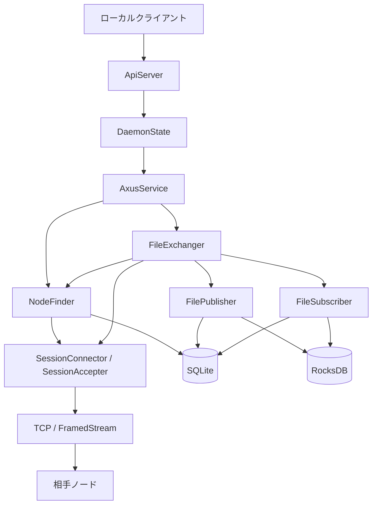
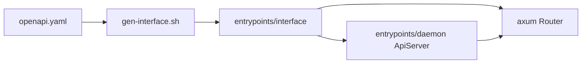
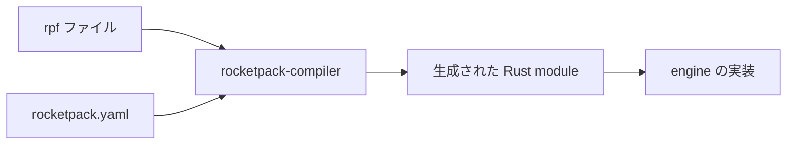
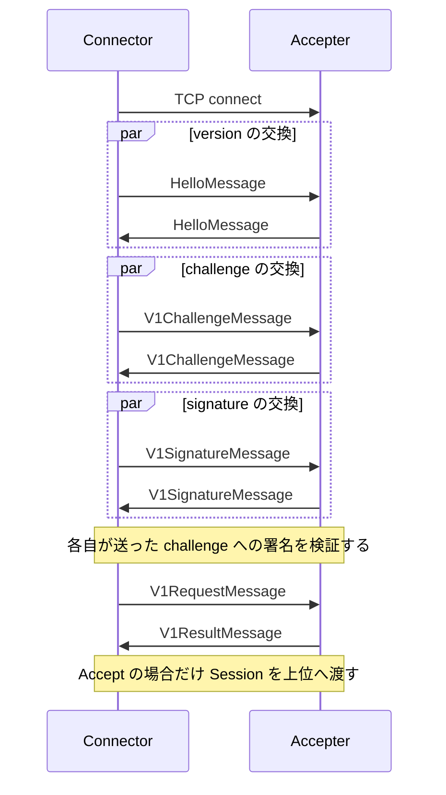
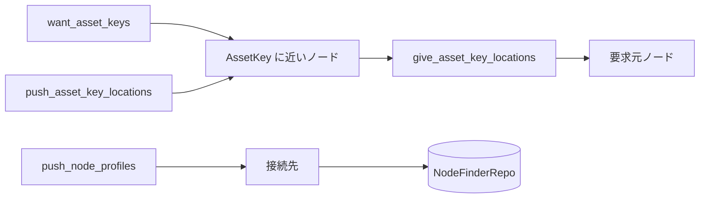
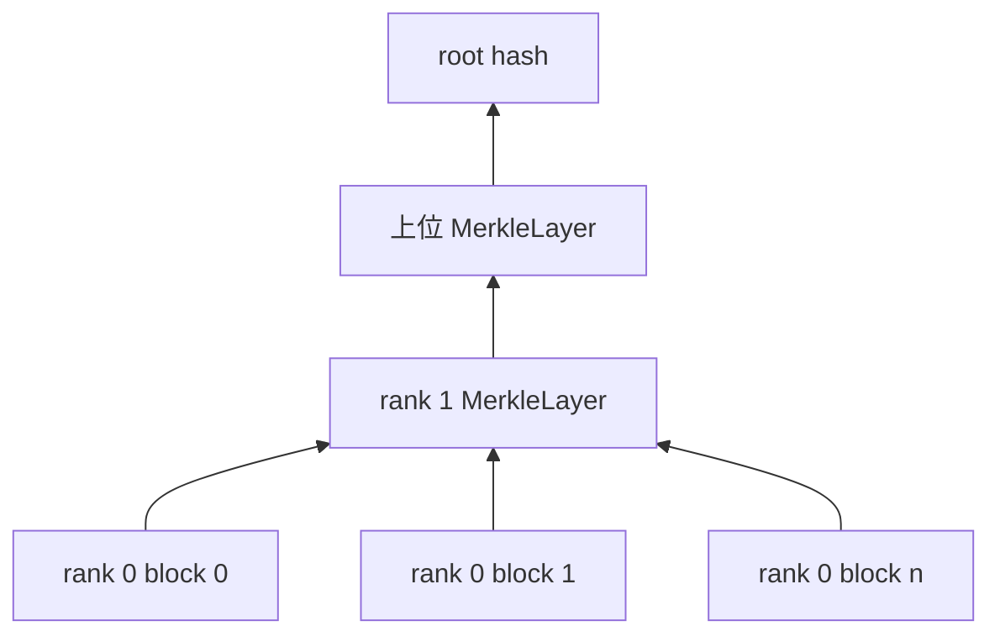
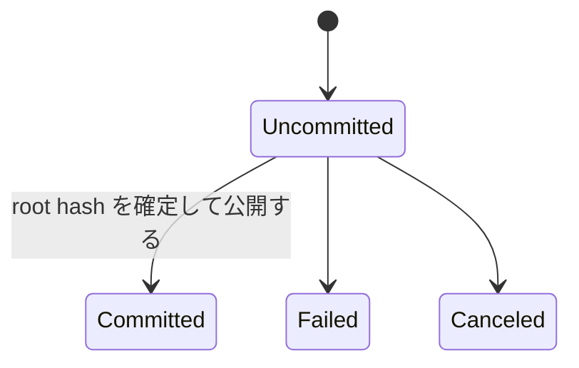
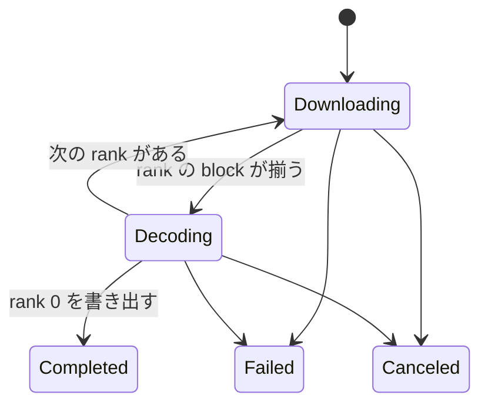

# Axus 設計書

## 1. このドキュメントについて

本書は、Axus の Rust 製 daemon が P2P ネットワーク上でノードを探索し、ファイルを公開および購読するための設計を扱う。
主な読者は、`daemon/` の実装を変更する開発者と、設計判断を引き継ぐ AI エージェントである。
本書は責務、不変条件、採用理由、保留中の論点を記録し、コードから機械的に取得できる定義の一覧は複写しない。

### 1.1 文書間の責務分担

| 文書または定義                                           | 正とする内容                                                       |
| -------------------------------------------------------- | ------------------------------------------------------------------ |
| 本書                                                     | daemon の責務、不変条件、設計判断、保留中の論点                    |
| [ISSUES.md](./ISSUES.md)                                 | コードで確認した明確な不具合と起票候補                             |
| [README.md](../README.md)                                | プロジェクト概要、セットアップ、開発手順                           |
| [openapi.yaml](../daemon/openapi.yaml)                   | REST API のパス、型、ステータスコード                              |
| [entrypoints/interface](../daemon/entrypoints/interface) | OpenAPI から生成する Rust interface                                |
| rpf ファイル                                             | RocketPack で符号化する型の定義とフィールド番号                    |
| [Rust ソース](../daemon)                                 | バイト列の形式、定数、依存バージョン                               |

本書には API の網羅的な一覧、RocketPack のフィールド番号、セットアップ手順、既知の不具合を置かない。
生成された `entrypoints/interface` は確認対象ではあるが、設計変更の編集先にはしない。

### 1.2 本書の時制について

§2 から §12 は、Axus が満たす設計を現在形で記述する。
実装がその設計にどこまで到達しているかは §14 にだけ記述する。
いま何が動くのかを知りたい場合は §14 を先に読む。

## 2. Axus daemon とは

Axus は、Web of Trust による保護を目標に掲げる P2P ファイル共有サービスである。
daemon は 1 ノード分のネットワーク接続、ノード探索、ファイルの符号化と復号、永続状態、ローカルクライアント向け REST API を 1 プロセスにまとめる。
ネットワーク規模、1 ノードあたりの利用者数、公開範囲の上限は、コードと既存文書からは確定できない。

### 2.1 スコープ外

コードと README から、プロダクトとして作らないと決めた機能は確認できない。
そのため本節では、本書の設計対象外だけを定める。

- daemon を操作する GUI と、その画面遷移は扱わない。
- 配布、監視、バックアップを含む運用基盤は扱わない。
- `core-rs` の内部設計は扱わず、Axus から見た契約だけを扱う。
- REST API と RocketPack の完全な wire format は、それぞれの正本に委ねる。

これらを本書の対象外とすることで、クライアント UI、配置トポロジー、外部定義の複写を設計書に持たずに済む。

## 3. 全体構成

### 3.1 コンポーネントとディレクトリ対応表

| パス                                                            | パッケージ名            | 役割                                                         |
| --------------------------------------------------------------- | ----------------------- | ------------------------------------------------------------ |
| [daemon/entrypoints/daemon](../daemon/entrypoints/daemon)       | `omnius-axus-daemon`    | CLI、設定、プロセスのライフサイクル、REST API の実装         |
| [daemon/entrypoints/interface](../daemon/entrypoints/interface) | `omnius-axus-interface` | OpenAPI から生成する axum router と型であり、手で編集しない  |
| [daemon/modules/engine](../daemon/modules/engine)               | `omnius-axus-engine`    | セッション、ノード探索、ファイル交換、永続化                 |
| [daemon/refs/core-rs](../daemon/refs/core-rs)                   | `omnius-core-*`         | 時刻、ID、署名、シリアライズ、マイグレーションなどの共通基盤 |

`daemon/` は Cargo workspace のルートであり、`core-rs` の必要な crate を workspace member として直接ビルドする。

### 3.2 処理の流れ

クライアントから P2P 通信までの責務は、上位から下位へ一方向に渡す。



API 層は engine を知るが、NodeFinder は FilePublisher と FileSubscriber を知らず、探索結果だけを返す。
この依存方向により、探索規則とファイルの意味論を別々に変更できる。

## 4. 中心概念

### 4.1 NodeProfile

**NodeProfile** は、P2P ネットワーク上の 1 ノードを探索するための識別子と到達先の組である。
コード上では [NodeProfile](../daemon/modules/engine/src/model/node_profile.rs) が `id` と複数の `OmniAddr` を持ち、外部表現では `axus:node/` から始まる URI になる。
NodeProfile の `id` は DHT の距離計算に使う値であり、セッションで相手が提示する署名鍵とは別の概念である。

### 4.2 Session

**Session** は、TCP 接続に相手の証明書、接続方向、用途を加えた通信路である。
コード上では [Session](../daemon/modules/engine/src/core/session/model.rs) が `SessionType`、`SessionHandshakeType`、`OmniCert`、`FramedStream` を保持する。
Session が証明するのはチャレンジに応答した鍵の所持であり、その相手を信頼してよいことまでは含まない。

### 4.3 AssetKey

**AssetKey** は、NodeFinder が所在を探索する対象の識別子である。
コード上では [AssetKey](../daemon/modules/engine/src/model/asset_key.rs) が文字列の種別と `OmniHash` を持つ。
AssetKey はネットワーク上の探索キーであり、表示名を含む FileRef や、所在を表す NodeProfile とは異なる。

### 4.4 FileRef

**FileRef** は、公開済みファイルを上位のデータモデルから参照するための名前とハッシュの組である。
コード上では [FileRef](../daemon/modules/engine/src/model/file_ref.rs) が `name` と `OmniHash` を持つ。
FileRef はファイル本体を含まず、NodeFinder の探索結果も含まない。

### 4.5 Profile と memo

**Profile** は、Web of Trust における主体の公開情報と、その主体が公開するデータを指す FileRef 群をまとめる概念である。
Profile のコード上の型名と外部表現は §13.2 で保留している。
**memo** は Profile を探索、交換、配布する下位機構を指し、投稿本文や添付データそのものを指さない。

### 4.6 rank と root hash

**rank** は Merkle 構造の階層であり、rank 0 がファイル本体のブロックを表す。
コード上では [MerkleLayer](../daemon/modules/engine/src/core/negotiator/file/model/merkle_layer.rs) が rank と下位ブロックのハッシュ列を持つ。
**root hash** は最上位の単一ブロックのハッシュであり、ファイル名や保存場所から独立した内容識別子である。

## 5. daemon と API 層

### 5.1 プロセスのライフサイクル

[Executor](../daemon/entrypoints/daemon/src/executor.rs) は設定ディレクトリを決定し、ファイルロックを取得して多重起動を防ぐ。
続いて設定と logging を初期化し、[DaemonState](../daemon/entrypoints/daemon/src/state.rs) を構築して [ApiServer](../daemon/entrypoints/daemon/src/server.rs) を起動する。
SIGINT または SIGTERM は共通の cancellation token に変換し、HTTP server と engine の停止を同じプロセス境界で管理する。

DaemonState は daemon の所有物を保持し、終了時には `AxusService::shutdown()` を起点として下位タスクを停止する。
所有関係と停止順序を同じ階層にすることで、バックグラウンドタスクの取り残しを防ぐ。

### 5.2 設定の境界

[config.rs](../daemon/entrypoints/daemon/src/config.rs) は、永続状態の置き場、待ち受けアドレス、logging を外部設定から内部型へ変換する。
HTTP API と P2P transport は別の待ち受け口であるため、両者のアドレスを別々に設定できなければならない。
一時ディレクトリはプロセス寿命に従い、再起動後も必要な情報は `state_dir` 配下に置く。

設定ファイル名、既定値、CLI オプションの正は README とコードに置く。
本書は、API と P2P の設定を混同しないこと、および永続状態と一時状態を分けることだけを規定する。

### 5.3 OpenAPI からのコード生成

REST API は [openapi.yaml](../daemon/openapi.yaml) を契約の正とし、生成物と手書き実装を分ける。



生成物を毎回作り直せることが前提なので、API 変更は OpenAPI と handler 実装にだけ加える。
この境界により、schema と router の手編集による食い違いを防ぐ。

## 6. RocketPack 型の生成

### 6.1 rpf を型定義の正とする

RocketPack で符号化する型は `.rpf` ファイルで定義し、Rust の型宣言と `RocketPackStruct` 実装を生成する。
生成には core-rs の [rocketpack-compiler](../daemon/refs/core-rs/entrypoints/rocketpack-compiler) を使い、Axus はこれを外部ツールとして扱う。
compiler の内部設計は §2.1 のとおり本書の対象外であり、本章は Axus から見た入出力と規約だけを定める。



型と field 番号の変更は rpf にだけ加え、生成物にも手書き実装にも加えない。
定義を rpf 1 箇所に集めることで、encode 側と decode 側の field 番号の対応を人手で保つ必要がなくなる。

### 6.2 生成の入力と出力

compiler は指定した directory の `rocketpack.yaml` を読み、`sources` と `generators` に従って生成する。
`sources` は `base_dir` と `includes`、`excludes` で対象の rpf を集める。
`generators` は plugin ごとに `targets` を持ち、`pattern` に一致した rpf を `dir` 配下へ書き出す。
出力は rpf 1 本につき Rust ファイル 1 本であり、ファイル名は rpf の stem を引き継ぐ。

`pattern` に一致しない rpf は生成対象から外れるため、rpf を追加したときは target の追加も必要になる。
同じ rpf を複数の generator へ渡せるので、言語ごとの出力先を 1 つの設定で管理できる。

`rocketpack.yaml` を置いた directory が生成の起点であり、`base_dir` と `dir` はそこからの相対 path として解決する。
設定 key の一覧と各 generator が解釈する option は、compiler のコードと [rocketpack-compiled-example](../daemon/refs/core-rs/entrypoints/rocketpack-compiled-example) が正である。

### 6.3 rpf が表現するもの

rpf は version、package、use、struct、enum、type alias、const を持つ。
package は生成 Rust の入れ子 module になり、use は生成 Rust の use として写す。
struct の field と enum の variant は `@N` の番号を持ち、この N が wire 上の field 番号である。
`Option<T>` の field は値が `None` のとき map から省き、要素数もそれに合わせて数える。
未知の番号を受け取った側は、その field を読み飛ばして残りの復号を続ける。

**rpf から外部型として参照する Rust 型は、`RocketPackStruct` を実装していなければならない。**
rpf 内で定義も alias もされていない名前は外部型として解決し、生成コードはその型の `RocketPackStruct` 実装を呼ぶ。
実装がない型を参照した場合、誤りは生成時ではなく Rust の compile 時に現れる。

### 6.4 手書き実装からの移行

移行の不変条件は wire format を変えないことである。
手書き実装が使っている field 番号をそのまま `@N` へ写し、番号の詰め直しや採番規則の統一を同時に行わない。
`Option` の省略規則、map の要素数の数え方、未知 field の読み飛ばしは生成コードと手書き実装で一致するため、移行で注意すべきなのは field 番号の写し間違いと外部型の符号化方法の 2 点である。

移行の単位は rpf ファイルとし、1 つの型の宣言と codec を手書きと生成物に分けない。
分けると、その型の正がどちらにあるかを読む側が判断できなくなる。

## 7. transport と session

### 7.1 接続とフレーム化

[connection](../daemon/modules/engine/src/base/connection.rs) は、TCP の受理と発信を trait の背後に置く。
発信側は直接 TCP と SOCKS5 proxy を同じ境界で扱い、受理側は必要に応じて UPnP の port mapping を扱う。
上位層は接続方法ではなく、`FramedStream` が提供する長さ区切りのメッセージ列だけを利用する。

RocketPack の encode と decode は [framed.rs](../daemon/modules/engine/src/base/connection/stream/framed.rs) の拡張を通す。
これにより session と negotiator は、TCP の partial read やメッセージ境界を扱わずに済む。

### 7.2 session の確立

発信側と受理側は、version、challenge、signature、用途の順に合意する。



用途の確定を認証の後に置くことで、未認証の接続を NodeFinder や FileExchanger のキューに入れない。
version 交渉は、双方が共通して対応する手順だけを選ばなければならない。

### 7.3 用途と停止

1 本の Session は NodeFinder または FileExchanger のどちらか一方に割り当てる。
用途ごとの受理キューと接続上限を分けることで、一方の負荷が他方の接続枠を使い切ることを防ぐ。
用途間の多重化を session 層に持ち込まないため、上位 protocol は自分の message だけを処理する。

[Shutdown](../daemon/modules/engine/src/base/runtime/shutdown.rs) は、所有する下位 component を順に停止するための共通契約である。
worker は cancellation token または join handle を通じて停止し、所有者の寿命を越えて残らない。

## 8. NodeFinder

### 8.1 責務

[NodeFinder](../daemon/modules/engine/src/core/negotiator/node/node_finder.rs) は、既知ノードの交換と、AssetKey を提供または要求するノードの所在情報を扱う。
NodeFinder はアセットの内容を解釈せず、AssetKey と NodeProfile の対応だけを返す。
FileExchanger はこの境界を使うため、ノード探索の message とファイル交換の message を混在させない。

[NodeProfileFetcher](../daemon/modules/engine/src/core/negotiator/node/node_profile_fetcher.rs) は bootstrap 用の NodeProfile 群を外部から取得する。
URI 変換の詳細と checksum は [converter/uri.rs](../daemon/modules/engine/src/model/converter/uri.rs) が正である。

### 8.2 情報の配布

NodeFinder は要求、回答、自発的な広告を分けて伝播させる。



要求と広告を XOR 距離の近いノードへ寄せる一方、回答は要求元へ戻す。
受信情報には寿命と件数上限を設け、古い所在情報と無制限な中継を残さない。

### 8.3 判断と通信の分離

[TaskComputer](../daemon/modules/engine/src/core/negotiator/node/task_computer.rs) は、全 session の受信状態と上位 component の要求を見て、次に送る DataMessage を計算する。
[TaskCommunicator](../daemon/modules/engine/src/core/negotiator/node/task_communicator.rs) は、session ごとの handshake と送受信だけを担当する。
判断を 1 箇所へ集約することで、接続ごとの worker に routing policy が分散しない。

FileExchanger から必要な AssetKey を受け取る境界には [FnHub](../daemon/modules/engine/src/base/sync/fn_hub.rs) を使う。
発火側と登録側を分けることで、NodeFinder は FileExchanger の具象型を参照しない。

### 8.4 距離と永続化

[Kadex](../daemon/modules/engine/src/core/negotiator/node/kadx.rs) は AssetKey の hash と NodeProfile の ID の XOR 距離を比較し、近いノードを選ぶ。
距離計算の byte order は protocol の相互運用性に関わるため、別実装を追加する場合はコード上の規則を外部仕様へ昇格させる。

[NodeFinderRepo](../daemon/modules/engine/src/core/negotiator/node/node_finder_repo.rs) は既知ノードを URI 表現のまま SQLite に保存する。
URI を opaque な値として保存することで形式追加のたびに table schema を変えずに済むが、address 単位の SQL 検索は行えない。

## 9. ファイルの公開と購読

### 9.1 責務の分割

[FilePublisher](../daemon/modules/engine/src/core/negotiator/file/file_publisher/publisher.rs) はローカルファイルを block と Merkle layer に変換し、公開可能な root hash を確定する。
[FileSubscriber](../daemon/modules/engine/src/core/negotiator/file/file_subscriber/subscriber.rs) は root hash から必要な block を管理し、揃った layer を上位から順に復号する。
[FileExchanger](../daemon/modules/engine/src/core/negotiator/file/file_exchanger.rs) は NodeFinder の探索結果を使って相手と Session を張り、publisher と subscriber の block を運ぶ。

符号化、転送、復号を分けることで、local storage の処理を network session の寿命から独立させる。
publisher と subscriber は公開用と購読用の状態を共有しない。

### 9.2 Merkle 構造

ファイル本体を rank 0 の固定長 block に分け、各 block の hash 列を上位の MerkleLayer として再帰的に block 化する。



root hash から下位 block の hash を段階的に得られるため、受信者はファイル全体の hash 一覧を事前に持つ必要がない。
各受信 block は期待する hash と照合してから保存または復号に使う。

MerkleLayer の rank は encoder と decoder が同じ意味で解釈しなければならない。
wire format と field 番号は [merkle_layer.rs](../daemon/modules/engine/src/core/negotiator/file/model/merkle_layer.rs) が正である。

### 9.3 状態遷移

公開側は root hash の確定前後を uncommitted と committed に分ける。



root hash が確定するまでは一時 ID を使い、確定後に内容識別子へ commit する。
この分離により、途中失敗した処理とネットワークへ広告可能なファイルを区別できる。

購読側は block の取得と layer の復号を交互に進める。



復号中に得た次の rank の hash 群が、次の Downloading の取得対象になる。
外部 API は内部状態名をそのまま公開せず、§13.2 の長時間操作の表現に従って安定した契約へ変換する。

### 9.4 接続相手と block の検証

公開側は自分が提供する AssetKey を要求するノードへ接続し、購読側は目的の AssetKey を提供するノードへ接続する。
相手の探索は NodeFinder に委ね、FileExchanger は探索 algorithm を持たない。
公開用、購読用、受理用の接続枠を分け、転送方向ごとの資源を確保する。

block 交換 protocol は、要求した hash、受信した hash、保存した block の対応を追跡しなければならない。
汚染 block を永続化しないため、内容 hash の検証は commit より前に行う。

## 10. 永続化

### 10.1 metadata と block の分離

| 種別     | 実体                              | 保存するもの                          |
| -------- | --------------------------------- | ------------------------------------- |
| metadata | SQLite と `omnius-core-migration` | 既知ノード、ファイル状態、block index |
| block    | `KeyValueRocksdbStorage`          | ファイル本体と MerkleLayer の byte 列 |

metadata は条件検索と状態遷移を必要とするため SQLite に置く。
block は hash key による読み書きが中心であり、大きな byte 列を metadata query から分離するため RocksDB に置く。

### 10.2 `state_dir` の構造

永続状態は component ごとに directory を分ける。

```text
<state_dir>/
├── repo/
├── file_publisher/
│   ├── repo/
│   └── blocks/
└── file_subscriber/
    ├── repo/
    └── blocks/
```

publisher と subscriber の保存領域を分けることで、一方の再構築や削除が他方の状態を直接壊さない。
directory 名の追加や移行が必要な場合は migration と rollback の単位を明示する。

### 10.3 論理 key と block 実体

[KeyValueRocksdbStorage](../daemon/modules/engine/src/base/storage/key_value_rocksdb_storage.rs) は、論理 key から内部 ID を引く `names` と、内部 ID から実体を引く `blocks` および `metas` を分ける。
公開処理の commit は論理 key を uncommitted から committed へ変更し、同じ block 実体を再利用する。

**rename の原子性は、対象が同じ RocksDB transaction 内にあることを前提とする。**
別 database または別 filesystem へまたがる移動を追加した場合、この前提は崩れ、copy と recovery protocol が必要になる。

### 10.4 schema migration

[publisher_repo.rs](../daemon/modules/engine/src/core/negotiator/file/file_publisher/publisher_repo.rs)、[subscriber_repo.rs](../daemon/modules/engine/src/core/negotiator/file/file_subscriber/subscriber_repo.rs)、[node_finder_repo.rs](../daemon/modules/engine/src/core/negotiator/node/node_finder_repo.rs) は、名前付きの MigrationRequest を順に適用する。
適用済みの名前を持つ migration は再実行しない。

配布済みの状態へ適用され得る migration は書き換えず、新しい名前の migration で前進させる。
初回 release 前の migration を直接修正する場合でも、適用済み状態が存在しないことを確認し、その確認結果を変更記録に残す。

## 11. セキュリティ境界

### 11.1 保証の分担

| 機構                           | 保証するもの                            | 保証しないもの                                 |
| ------------------------------ | --------------------------------------- | ---------------------------------------------- |
| session の challenge signature | 相手が応答に使った秘密鍵を所持すること  | DHT 上の NodeProfile.id との結合、相手への信頼 |
| FramedStream                   | message 境界                            | 通信内容の機密性と改竄検出                     |
| Merkle hash                    | 期待する hash に対する block 内容の一致 | 提供者の信頼性、検索結果の正当性               |
| Web of Trust                   | §13.2 で決める信頼 policy               | transport の暗号化と block の内容検証          |

認証、暗号化、内容 hash、信頼評価は別の保証であり、どれか 1 つで他を代替しない。
特に session 認証が成功しても、相手の NodeProfile と公開内容を信頼できるとは限らない。

### 11.2 脅威モデル

NodeProfile.id を低コストで選べる場合、攻撃者は AssetKey に近い ID を集める Sybil 攻撃と Eclipse 攻撃を行える。
既知ノードと伝播情報の件数上限は資源消費を抑えるが、攻撃者の情報だけが残ることは防がない。
Web of Trust はこの信頼選別を担うが、transport の盗聴と改竄には別の secure channel が必要である。

NodeFinder の中継は情報を増幅し得るため、TTL、件数、接続数、message size の上限を protocol の入力境界で強制する。
FileExchanger は受信 block を hash 検証し、Profile 交換は署名と version 検証を通す。

## 12. Profile と memo

### 12.1 Profile が参照するデータ

Profile は投稿本文や添付 byte 列を直接埋め込まず、公開済み File の FileRef を保持する。
投稿群をまとめた File と、利用者が個別に公開した File は、どちらも先に FilePublisher へ渡して root hash を得る。
上位サービス層はその結果から FileRef を構築し、Profile の分類規則に従って登録する。

この構造により、大きなデータの配布と Profile の更新を同じ protocol に重ねずに済む。
Profile の真正性を検証しても、参照先 File の block hash 検証は省略しない。

### 12.2 層ごとの責務

| 層                             | 責務                                                   | 知らないもの         |
| ------------------------------ | ------------------------------------------------------ | -------------------- |
| FilePublisher と FileExchanger | File の公開、探索、block 転送                          | 投稿、Profile の意味 |
| 将来の MemoExchanger           | Profile の探索、交換、配布                             | 投稿本文、添付の解釈 |
| 上位サービス層                 | 投稿データの構築、FileRef の分類、Profile の生成と更新 | block 転送の詳細     |

下位層は Profile を opaque な payload として扱い、上位層だけが FileRef の意味を解釈する。
この境界により、掲示板や timeline のデータモデルを変えても、memo の探索と配布を作り直さずに済む。

## 13. 設計判断

### 13.1 決定済み

#### OpenAPI を REST 契約の正とする

**決定**
REST API の path、schema、status code は `openapi.yaml` で定義し、Rust interface は生成する。

**理由**
schema、router、client が別々の定義を持つ状態を避け、変更点を 1 箇所に集約するためである。

**却下案**
生成された interface の直接編集は、再生成で失われ、OpenAPI と実装を食い違わせるため採用しない。

#### RocketPack 型を rpf から生成する

**決定**
RocketPack で符号化する型は rpf を正とし、Rust の型宣言と `RocketPackStruct` 実装を生成する。
生成物は手で編集せず、型と field 番号の変更は rpf にだけ加える。

**理由**
手書きでは pack と unpack が同じ field 番号を別々の箇所で扱い、対応のずれを型で検出できないためである。
定義を 1 箇所に集めることで、Rust 以外の言語向けの生成先を後から追加する余地も残る。

**却下案**
手書きの `RocketPackStruct` 実装を続ける案は、既存コードに採用の痕跡があるが、型の正が実装の中に散るため採用しない。

#### 1 Session を 1 用途に割り当てる

**決定**
NodeFinder と FileExchanger は別の Session を使い、用途ごとの受理 queue と接続上限を持つ。

**理由**
message protocol と接続資源を用途ごとに隔離し、一方の負荷が他方の処理を占有しないようにするためである。

#### 探索とファイル交換を分離する

**決定**
NodeFinder は AssetKey から NodeProfile を探し、FileExchanger はその結果を使って block を交換する。

**理由**
探索 algorithm がファイル形式を知らず、publisher と subscriber が DHT message を知らない依存方向を保つためである。

#### metadata と block 実体を別の storage に置く

**決定**
検索と状態遷移を伴う metadata は SQLite に置き、hash key で扱う block 実体は RocksDB に置く。

**理由**
関係 query と大きな byte 列の読み書きを同じ storage model に押し込めず、それぞれの access pattern に合わせるためである。

#### Profile は公開データを FileRef で参照する

**決定**
Profile は投稿本文と添付を埋め込まず、FilePublisher で公開したデータの FileRef を保持する。
MemoExchanger は Profile の意味を解釈せず、探索、交換、配布だけを担う。

**理由**
内容配布を既存の File protocol に集約し、Profile と掲示板の model を transport から分離するためである。

### 13.2 保留

#### NodeProfile.id と署名鍵の結合

**現状**
Session は OmniCert を保持し、NodeProfile は独立した ID を持つため、両者を同じ主体として検証する規則がない。

候補は次の 3 つである。

1. 公開鍵から NodeProfile.id を導出すると結合は単純になるが、鍵 rotation で ID が変わる。
2. 安定した NodeProfile.id と鍵の対応を署名すると rotation を表現できるが、証明 chain と失効処理が必要になる。
3. 両者を分離したまま trust graph で対応を表すと柔軟だが、すべての照合が複雑になる。

**なぜ今決めないか**
File の local encoding と NodeFinder の情報交換は、この結合規則がなくても個別に検証できるためである。

**決める条件**
Profile の主体と真正性を wire format に定義する前、または Web of Trust の edge を実装する前に決める。

#### Session の secure channel

**現状**
相互 challenge signature の後も Session は FramedStream を使い、暗号化と message authentication の方式は定めていない。

候補は次の 2 つである。

1. `core-rs` の `OmniSecureStream` を適用すると既存部品を再利用できるが、handshake 順序と鍵導出の適合を確認する必要がある。
2. Session protocol 専用の鍵合意を定義すると用途に合わせられるが、新しい暗号 protocol の設計と監査が必要になる。

**なぜ今決めないか**
local の構成確認と storage 処理は secure channel の wire format に依存しないためである。

**決める条件**
信頼できない network で FileExchanger または Profile 交換を有効にする前に決める。

#### Session の version 選択

**現状**
[session/message.rs](../daemon/modules/engine/src/core/session/message.rs) と [task_communicator.rs](../daemon/modules/engine/src/core/negotiator/node/task_communicator.rs) は、対応 version を bit flag で交換する。
定義されている version は V1 だけであり、複数の共通 version から 1 つを選ぶ規則は定めていない。

候補は次の 2 つである。

1. 数値が最も大きい共通 version を選ぶと新機能を優先できるが、version 番号と優先順位を常に一致させる必要がある。
2. 明示的な優先順位表から選ぶと安定版を優先できるが、version 追加のたびに表を更新する必要がある。

**なぜ今決めないか**
V1 しか存在しないため、どちらの規則でも交渉結果が変わらない。

**決める条件**
`SessionVersion` または `NodeFinderVersion` に 2 つ目の version を追加する前に決める。

#### NodeFinder の能動探索と冗長度

**現状**
所在情報は定期的な伝播で集め、lookup は接続中 Session の受信状態を走査する形である。

候補は次の 2 つである。

1. Kademlia 型の反復 query を加えると到達率と遅延を制御できるが、query state、timeout、並列度が増える。
2. 伝播だけを維持すると protocol は単純だが、情報が届くまでの時間と未到達を制御しにくい。

**なぜ今決めないか**
実運用規模における lookup の到達率と遅延を測定していないためである。

**決める条件**
複数 hop の結合試験で、購読開始に必要な所在情報の到達率と遅延を測定した時点で決める。

#### MerkleLayer.rank の意味

**現状**
MerkleLayer の rank が、その layer を格納する block の rank と、layer が列挙する子 block の rank のどちらを指すかを契約として定めていない。

候補は次の 2 つである。

1. 格納先 block の rank を持たせると encoder の生成位置と一致するが、decoder は次の rank を別途計算する必要がある。
2. 子 block の rank を持たせると decoder の遷移を直接表せるが、encoder は格納先から 1 を引いて記録する必要がある。

**なぜ今決めないか**
どちらの意味も Merkle 構造を表現でき、互換性を保証する既存 wire data と encode から decode までの成功試験がないためである。

**決める条件**
[ISSUES.md](./ISSUES.md) の I-4 を修正する前に決め、選んだ意味を encode と decode の contract test で固定する。

#### rpf から参照する core-rs 型の扱い

**現状**
`OmniHash` は `RocketPackStruct` を実装しており、手書き実装も `write_struct` で符号化しているため、rpf からは外部型としてそのまま参照できる。
`OmniAddr` は実装を持たず、手書きの `NodeProfile` は string として符号化している。

候補は次の 2 つである。

1. core-rs 側に `RocketPackStruct` を実装して外部型として参照すると、型と符号化を 1 箇所に置けるが、core-rs の型の wire format を Axus の都合で決めることになる。
2. rpf では string や bytes などの組み込み型で表すと core-rs を変更せずに済むが、Rust 型との変換が Axus 側に手書きで残る。

**なぜ今決めないか**
現在の wire format を保つ実装はどちらの案でも書けるため、選択は変換を core-rs と Axus のどちらに置くかの問題に留まるためである。

**決める条件**
`OmniAddr` のように `RocketPackStruct` を持たない core-rs 型を含む型を、最初に rpf へ移す前に決める。

#### Web of Trust の単位と伝播

**現状**
README は Web of Trust による検索と公開の保護を掲げるが、信頼対象と score の計算規則を定めていない。

候補は次の 2 つである。

1. 直接署名だけを使うと説明と失効が単純だが、未知の主体を評価できない。
2. 推移的な trust を使うと discovery 範囲が広がるが、深さ、減衰、循環、Sybil 耐性を規定する必要がある。

**なぜ今決めないか**
NodeProfile.id と署名鍵の結合が先に必要であり、信頼を適用する API も確定していないためである。

**決める条件**
検索結果または Profile を trust score で選別する最初の API を定義する前に決める。

#### Profile の形式と更新

**現状**
Profile が FileRef 群を持ち、memo が Profile を配布する責務境界だけを定めている。

候補は次の 2 つである。

1. version 付きの immutable Profile を連鎖させると履歴検証が容易だが、最新版探索と storage 回収が必要になる。
2. 主体ごとの mutable な最新版を配布すると取得は単純だが、競合、rollback、replay の規則が必要になる。

**なぜ今決めないか**
identity と Web of Trust の署名対象が決まるまで、Profile の真正性と競合解決を定義できないためである。

**決める条件**
Profile 型、MemoRef、MemoExchanger のいずれかを protocol surface として実装する前に決める。

#### 長時間 REST 操作の表現

**現状**
ファイルの符号化、取得、復号は内部状態を持つ長時間処理であり、外部 API への写し方を定めていない。

候補は次の 2 つである。

1. job resource を作って polling させると再接続に強いが、job の保存期間と cancel contract が必要になる。
2. stream または server-sent event で進捗を返すと即時性があるが、切断時の再開規則が必要になる。

**なぜ今決めないか**
FilePublisher と FileSubscriber の public operation が daemon 層に接続されるまでは、安定させるべき外部 contract がないためである。

**決める条件**
公開開始、購読開始、進捗取得の endpoint を `openapi.yaml` に追加する前に決める。

## 14. 現状と残作業

### 14.1 現状

| 領域               | コードで確認した現状                                                                                                                         |
| ------------------ | -------------------------------------------------------------------------------------------------------------------------------------------- |
| daemon と REST API | Executor は config、file lock、signal、HTTP server を組み立てるが、DaemonState は AxusService を保持せず、health handler は `todo!()` である |
| AxusService        | NodeFinder だけを構築して shutdown し、FileExchanger を所有しない                                                                            |
| session            | version、challenge、signature、用途選択の message があり、Session は暗号化されていない FramedStream を保持する                               |
| NodeFinder         | 接続、受理、計算、通信の task と SQLite repo があり、lookup は接続中 Session の受信状態だけを走査する                                        |
| FilePublisher      | File の block 化、MerkleLayer の生成、root hash の確定、commit 用の処理がある                                                                |
| FileSubscriber     | block の保存と rank ごとの復号処理があるが、購読を作成する daemon API はない                                                                 |
| FileExchanger      | 接続と受理の task はあるが、block 要求と応答の message および送受信 loop がない                                                              |
| Profile と memo    | FileRef 型はあるが、memo と MemoRef の module は空であり、Profile 型と上位サービス層はない                                                   |
| 永続化             | NodeFinder、publisher、subscriber の repo と block storage があるが、ファイル経路には既知の schema 不具合がある                              |
| RocketPack 型      | engine の型は手書きの `RocketPackStruct` 実装であり、Axus に rpf と `rocketpack.yaml` はない                                                 |
| rpf の生成器       | compiler の rust generator だけが Rust を出力し、csharp と swift は log を残して生成を飛ばす                                                 |

`todo!()` の現物は `rg 'todo!\(' daemon --glob '*.rs' --glob '!target/**'` で確認できる。
空の module や結線されていない component は、この検索だけでは検出できない。

### 14.2 ロードマップ

次の順序は暫定であり、守る必要があるのは表中の依存関係だけである。

| 番号 | 内容                                                                                 | 前提とする依存                                            |
| ---- | ------------------------------------------------------------------------------------ | --------------------------------------------------------- |
| 1    | HTTP と P2P の設定を分離し、DaemonState が AxusService を所有して停止まで管理する    | §13.2 の secure channel は後から決められる                |
| 2    | session と NodeFinder を daemon の起動経路から結合試験する                           | 1、関連する既知の不具合の解消                             |
| 3    | publisher と subscriber の schema を修正し、初期化、符号化、復号を実データで検証する | 適用済み migration の有無の確認                           |
| 4    | FileExchanger の block 交換 protocol と hash 検証を定義して実装する                  | 2、3、secure channel の判断                               |
| 5    | 公開、購読、進捗、cancel の REST API を定義する                                      | 4、§13.2 の長時間操作の判断                               |
| 6    | identity、Web of Trust、Profile、memo を順に定義する                                 | §13.2 の identity と trust の判断、FileRef を解決できる 4 |
| 7    | 手書きの RocketPack 型を rpf へ移し、生成物へ置き換える                              | §13.2 の core-rs 型の扱いの判断                           |

確認済みの不具合と修正方針は [ISSUES.md](./ISSUES.md) を参照する。
