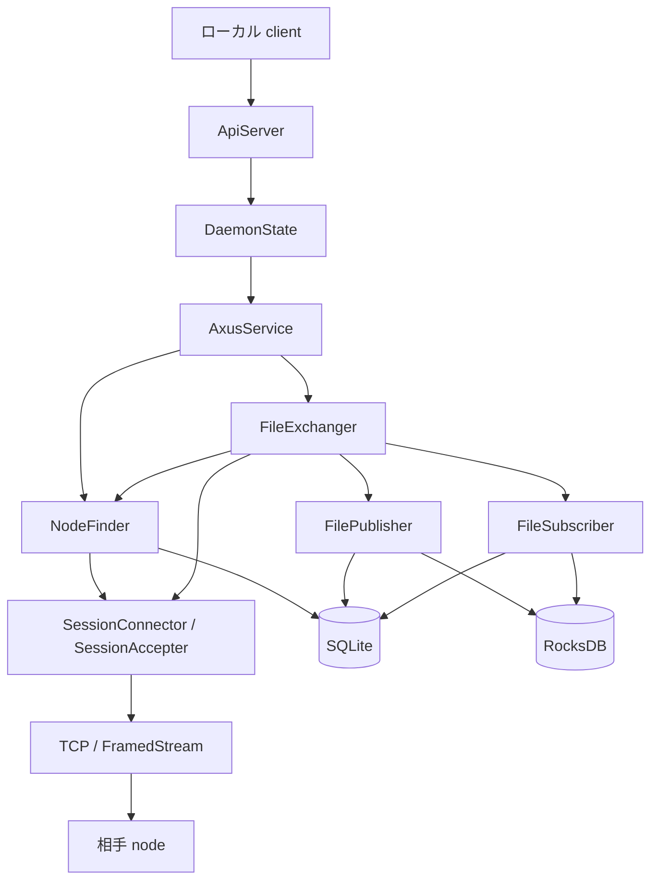

# Axus 設計書

## 1. このドキュメントについて

本書は、Axus の Rust 製 daemon が P2P ネットワーク上でノードを探索し、ファイルを公開および購読するための全体設計を扱う。
主な読者は、`daemon/` の実装を変更する開発者と、設計判断を引き継ぐ AI エージェントである。
本書は [terms.md](./terms.md) の語彙を前提とする。語の定義は本書にない。

### 1.1 文書間の責務分担

| 文書または正本 | 正とする内容 |
| --- | --- |
| 本書 | プロジェクト全体のスコープ、全体構成、関心事間の境界、横断的な設計判断、全体の依存関係 |
| [terms.md](./terms.md) | プロジェクト固有の語の定義、表記、隣接語との境界 |
| [issues.md](./issues.md) | コードで確認した明確な不具合と修正までの追跡 |
| `knowledges.md`（未作成） | 外部の挙動を確認した最初の項目と同時に作る、出所付きの外部知識 |
| `plans.md`（未作成） | 進行中の実装作業が発生した時点で、その子文書と同時に作る計画の一覧 |
| `reviews.md`（未作成） | 最初の review 結果と同時に作る、review の履歴と指摘の転記状態 |
| [daemon-api.md](./design/daemon-api.md) | daemon のライフサイクル、設定境界、REST API と OpenAPI 生成 |
| [rocketpack.md](./design/rocketpack.md) | RocketPack 型の生成、wire format の移行規約 |
| [session.md](./design/session.md) | transport、Session の確立、用途分離、停止 |
| [node-finder.md](./design/node-finder.md) | ノード探索、情報伝播、距離計算、探索状態 |
| [file-transfer.md](./design/file-transfer.md) | ファイルの公開、購読、Merkle 構造、block の検証 |
| [storage.md](./design/storage.md) | metadata と block の保存、状態 directory、migration |
| [trust-security.md](./design/trust-security.md) | 認証、暗号化、内容検証、identity、Web of Trust |
| [profile-memo.md](./design/profile-memo.md) | Profile と memo の責務境界、参照する公開データ |
| [README.md](../README.md) | プロジェクト概要、セットアップ、開発手順 |
| [openapi.yaml](../daemon/openapi.yaml) | REST API の path、schema、status code |
| [entrypoints/interface](../daemon/entrypoints/interface) | OpenAPI から生成する Rust interface |
| `.rpf` ファイル | RocketPack で符号化する型の定義と field 番号 |
| [Rust ソース](../daemon) | バイト列の形式、定数、依存 version |

本書には API の網羅的な一覧、RocketPack の field 番号、セットアップ手順、既知の不具合を置かない。
生成された `entrypoints/interface` は確認対象ではあるが、設計変更の編集先にはしない。

### 1.2 本書の時制について

本文は、Axus が満たす設計を現在形で記述する。
実装状況は各設計詳細文書の「現状と残作業」に集約する。
関心事ごとの実装状況は対応する詳細文書を先に読む。

## 2. Axus daemon とは

Axus は、個人の server や PC で動かすファイル交換 service である。
オープンソースで開発し、データの安全で安価な個人間共有を可能にすること、および BitTorrent の検索における単一障害点を解消することを目的とする。
daemon は 1 node 分のネットワーク接続、ノード探索、ファイルの符号化と復号、永続状態、ローカル client 向け REST API を 1 process にまとめる。

### 2.1 スコープ外

- daemon を操作する GUI と、その画面遷移は扱わない。
- 配布、監視、backup を含む運用基盤は扱わない。
- `core-rs` の内部設計は扱わず、Axus から見た contract だけを扱う。
- REST API と RocketPack の完全な wire format は、それぞれの正本に委ねる。

これらを対象外にすることで、client UI、配置 topology、外部定義の複写を設計書に持たない。

## 3. 全体構成

### 3.1 コンポーネントと directory 対応表

| パス | package | 役割 |
| --- | --- | --- |
| [daemon/entrypoints/daemon](../daemon/entrypoints/daemon) | `omnius-axus-daemon` | CLI、設定、process のライフサイクル、REST API の実装 |
| [daemon/entrypoints/interface](../daemon/entrypoints/interface) | `omnius-axus-interface` | OpenAPI から生成する axum router と型であり、手で編集しない |
| [daemon/modules/engine](../daemon/modules/engine) | `omnius-axus-engine` | Session、ノード探索、ファイル交換、永続化 |
| [daemon/refs/core-rs](../daemon/refs/core-rs) | `omnius-core-*` | 時刻、ID、署名、serialization、migration などの共通基盤 |

`daemon/` は Cargo workspace の root であり、`core-rs` の必要な crate を workspace member として直接 build する。

### 3.2 処理の流れ

client から P2P 通信までの責務は、上位から下位へ一方向に渡す。

API 層は engine を知るが、NodeFinder は FilePublisher と FileSubscriber を知らず、探索結果だけを返す。
この依存方向により、探索規則とファイルの意味論を別々に変更できる。

## 4. 設計詳細

| 関心事 | 受け持つ設計文書 | ほかの関心事との境界 |
| --- | --- | --- |
| daemon と REST API | [daemon-api.md](./design/daemon-api.md) | engine の所有と外部 contract を結び、P2P protocol は持たない |
| RocketPack 型 | [rocketpack.md](./design/rocketpack.md) | wire 型の正を持ち、compiler の内部設計は持たない |
| transport と Session | [session.md](./design/session.md) | 接続を認証して用途へ渡し、探索と file message は解釈しない |
| NodeFinder | [node-finder.md](./design/node-finder.md) | AssetKey と NodeProfile の対応を扱い、file 内容を解釈しない |
| file の公開と購読 | [file-transfer.md](./design/file-transfer.md) | block を公開、購読、検証し、探索 algorithm は持たない |
| 永続化 | [storage.md](./design/storage.md) | metadata と block 実体の保存を扱い、上位 protocol は持たない |
| trust と security | [trust-security.md](./design/trust-security.md) | 各層の保証と限界を定め、個別の暗号 protocol を選ばない |
| Profile と memo | [profile-memo.md](./design/profile-memo.md) | 上位データの参照と配布を扱い、投稿本文と block 転送を解釈しない |

## 5. 設計判断

### 5.1 決定済み

#### 探索とファイル交換を分離する

**決定**
NodeFinder は AssetKey から NodeProfile を探し、FileExchanger はその結果を使って block を交換する。

**理由**
探索 algorithm がファイル形式を知らず、publisher と subscriber が DHT message を知らない依存方向を保つためである。

### 5.2 保留

全体を横断する保留はない。
関心事に閉じる保留は、各設計詳細文書の「設計判断」に置く。

## 6. 現状と残作業

### 6.1 現状

関心事ごとの実装状況は、各設計詳細文書が正とする。
全体としては、daemon の起動経路が NodeFinder までを所有しており、ファイル公開、購読、P2P 転送、REST API を通す end-to-end の経路は完成していない。

### 6.2 ロードマップ

次の順序は暫定であり、守る必要があるのは表中の依存関係だけである。

| 番号 | 内容 | 前提とする依存 |
| --- | --- | --- |
| 1 | session と NodeFinder を daemon の起動経路から結合試験する | 関連する既知の不具合の解消 |
| 2 | publisher と subscriber の schema を修正し、初期化、符号化、復号を実データで検証する | 適用済み migration の有無の確認 |
| 3 | FileExchanger の block 交換 protocol と hash 検証を定義して実装する | 1、2、secure channel の判断 |
| 4 | 公開、購読、進捗、cancel の REST API を定義する | 3、[daemon-api.md](./design/daemon-api.md#5-設計判断) の長時間操作の判断 |
| 5 | identity、Web of Trust、Profile、memo を順に定義する | [trust-security.md](./design/trust-security.md#4-設計判断)、FileRef を解決できる 3 |
| 6 | 手書きの RocketPack 型を rpf へ移し、生成物へ置き換える | [rocketpack.md](./design/rocketpack.md#5-設計判断) の外部型の判断 |

確認済みの不具合と修正方針は [issues.md](./issues.md) を参照する。
