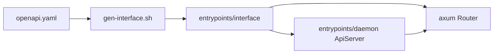

# daemon と API 層の設計

## 1. このドキュメントについて

本書は daemon process のライフサイクル、設定境界、REST API の contract と生成物の境界を扱う。
語の定義は [terms.md](../terms.md) が正とする。

### 1.1 文書間の責務分担

| 文書または正本 | 受け持つもの |
| --- | --- |
| [design.md](../design.md#11-文書間の責務分担) | 全体構成、他の関心事との境界、横断的な依存関係 |
| 本書 | daemon の所有関係、設定境界、REST API と生成の設計 |
| [openapi.yaml](../../daemon/openapi.yaml) | REST API の path、schema、status code |
| [entrypoints/interface](../../daemon/entrypoints/interface) | OpenAPI から生成する Rust interface |
| [entrypoints/daemon](../../daemon/entrypoints/daemon) | daemon の実装 |

### 1.2 本書の時制について

本文は完成形の設計を記述する。
実装状況と残作業は §6 に集約する。

## 2. 責務と境界

daemon は engine を所有して起動と停止を管理し、local client へ REST API を提供する。
P2P transport、探索、file protocol の意味論は、それぞれの設計文書が持つ。

## 3. process のライフサイクル

[Executor](../../daemon/entrypoints/daemon/src/executor.rs) は設定 directory を決定し、file lock を取得して多重起動を防ぐ。
続いて設定と logging を初期化し、[DaemonState](../../daemon/entrypoints/daemon/src/state.rs) を構築して [ApiServer](../../daemon/entrypoints/daemon/src/server.rs) を起動する。
SIGINT または SIGTERM は共通の cancellation token に変換し、HTTP server と engine の停止を同じ process 境界で管理する。

DaemonState は daemon の所有物を保持し、終了時には `AxusService::shutdown()` を起点として下位 task を停止する。
所有関係と停止順序を同じ階層にすることで、background task の取り残しを防ぐ。

## 4. 設定と OpenAPI 生成

### 4.1 設定の境界

[config.rs](../../daemon/entrypoints/daemon/src/config.rs) は、永続状態の置き場、待ち受け address、他の node に広告する address と UPnP の利用、起動時に接続する bootstrap node、logging を外部設定から内部型へ変換する。
HTTP API と P2P transport は別の待ち受け口であるため、両者の address を別々に設定できなければならない。
一時 directory は process 寿命に従い、再起動後も必要な情報は `state_dir` 配下に置く。

設定 file 名、既定値、CLI option の正は README と code に置く。
本書は、API と P2P の設定を混同しないこと、および永続状態と一時状態を分けることだけを規定する。

### 4.2 OpenAPI からの code generation

REST API は [openapi.yaml](../../daemon/openapi.yaml) を contract の正とし、生成物と手書き実装を分ける。

生成物を毎回作り直せることが前提なので、API 変更は OpenAPI と handler 実装にだけ加える。
この境界により、schema と router の手編集による食い違いを防ぐ。

## 5. 設計判断

### 5.1 決定済み

#### OpenAPI を REST contract の正とする

**決定**
REST API の path、schema、status code は `openapi.yaml` で定義し、Rust interface は生成する。

**理由**
schema、router、client が別々の定義を持つ状態を避け、変更点を 1 箇所に集約するためである。

**却下案**
生成された interface の直接編集は、再生成で失われ、OpenAPI と実装を食い違わせるため採用しない。

### 5.2 保留

#### 長時間 REST 操作の表現

**現状**
file の符号化、取得、復号は内部状態を持つ長時間処理であり、外部 API への写し方を定めていない。

候補は次の 2 つである。

1. job resource を作って polling させると再接続に強いが、job の保存期間と cancel contract が必要になる。
2. stream または server-sent event で進捗を返すと即時性があるが、切断時の再開規則が必要になる。

**なぜ今決めないか**
FilePublisher と FileSubscriber の public operation が daemon 層に接続されるまでは、安定させるべき外部 contract がないためである。

**決める条件**
公開開始、購読開始、進捗取得の endpoint を `openapi.yaml` に追加する前に決める。

#### REST API の到達範囲と認証

**現状**
REST API は認証を持たず、`openapi.yaml` の health は `security: []` である。
待ち受け address は設定 `api.listen_addr` で自由に選べ、local client だけが接続する前提を daemon は強制していない。

候補は次の 2 つである。

1. loopback address だけで待ち受けることを強制すると認証を持たずに済むが、別の machine の client から操作できない。
2. token などの認証を加えると待ち受け address を自由にできるが、token の発行と保管の手順が必要になる。

**なぜ今決めないか**
状態を変える endpoint がなく、health 以外に守るべき操作がないためである。

**決める条件**
公開や購読のように状態を変える最初の endpoint を `openapi.yaml` に追加する前に決める。

## 6. 現状と残作業

Executor は config、file lock、signal、HTTP server を組み立て、DaemonState は AxusService を所有して停止まで管理する。
API と P2P は別の待ち受け address を持ち、health handler は稼働を返す。
file 公開、購読、進捗、cancel の endpoint は未定義である。

確認済みの不具合は [issues.md](../issues.md) を参照する。
