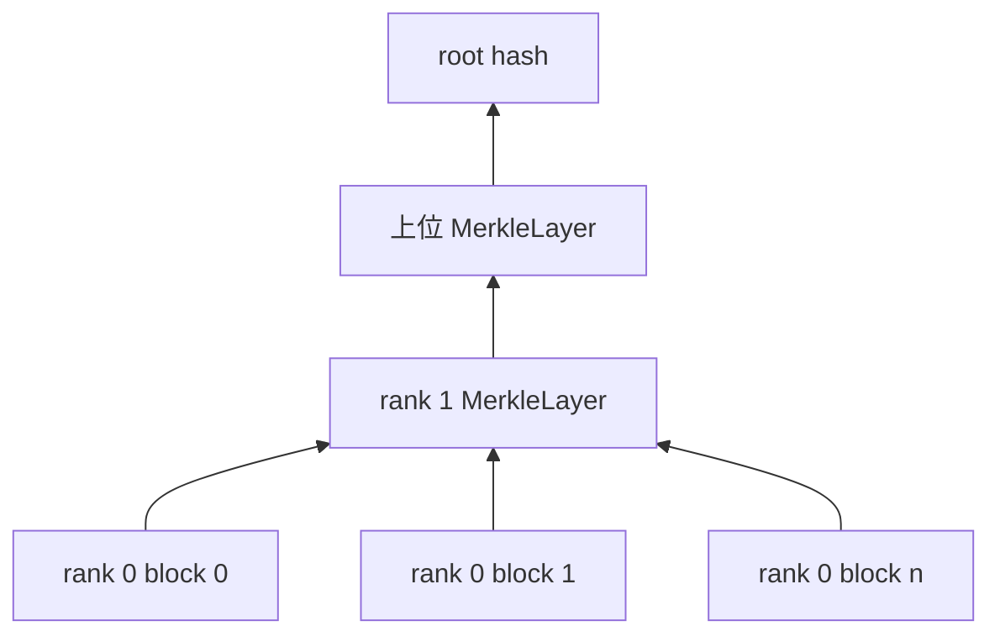
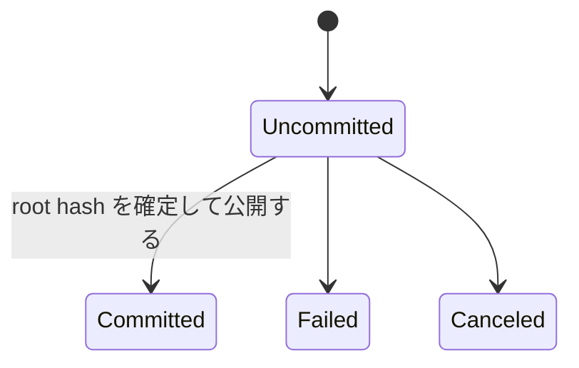
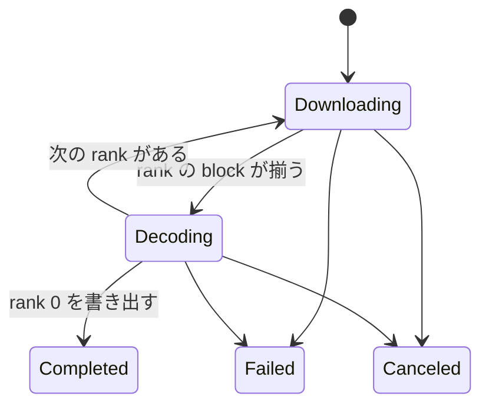

# file の公開と購読の設計

## 1. このドキュメントについて

本書は file を block と Merkle layer へ変換して公開し、購読側で検証および復号する設計を扱う。
語の定義は [terms.md](../terms.md) が正とする。

### 1.1 文書間の責務分担

| 文書または正本 | 受け持つもの |
| --- | --- |
| [design.md](../design.md#11-文書間の責務分担) | 全体構成、他の関心事との境界、横断的な依存関係 |
| 本書 | file の公開、購読、Merkle 構造、block の検証 |
| [node-finder.md](./node-finder.md#2-責務と境界) | AssetKey に対応する node の探索 |
| [storage.md](./storage.md#2-責務と境界) | metadata と block 実体の保存 |
| [core/negotiator/file](../../daemon/modules/engine/src/core/negotiator/file) | file 公開、購読、転送の実装 |

### 1.2 本書の時制について

本文は完成形の設計を記述する。
実装状況と残作業は §6 に集約する。

## 2. 責務と境界

[FilePublisher](../../daemon/modules/engine/src/core/negotiator/file/file_publisher/publisher.rs) は local file を block と Merkle layer に変換し、公開可能な root hash を確定する。
[FileSubscriber](../../daemon/modules/engine/src/core/negotiator/file/file_subscriber/subscriber.rs) は root hash から必要な block を管理し、揃った layer を上位から順に復号する。
[FileExchanger](../../daemon/modules/engine/src/core/negotiator/file/file_exchanger.rs) は NodeFinder の探索結果を使って相手と Session を張り、publisher と subscriber の block を運ぶ。

符号化、転送、復号を分けることで、local storage の処理を network Session の寿命から独立させる。
publisher と subscriber は公開用と購読用の状態を共有しない。

## 3. Merkle 構造

file 本体を rank 0 の固定長 block に分け、各 block の hash 列を上位の MerkleLayer として再帰的に block 化する。

root hash から下位 block の hash を段階的に得られるため、受信者は file 全体の hash 一覧を事前に持つ必要がない。
各受信 block は期待する hash と照合してから保存または復号に使う。
MerkleLayer の rank は encoder と decoder が同じ意味で解釈しなければならない。

## 4. 状態遷移

公開側は root hash の確定前後を uncommitted と committed に分ける。

root hash が確定するまでは一時 ID を使い、確定後に内容識別子へ commit する。
この分離により、途中失敗した処理と network へ広告可能な file を区別できる。

購読側は block の取得と layer の復号を交互に進める。

復号中に得た次の rank の hash 群が、次の Downloading の取得対象になる。
外部 API は内部状態名をそのまま公開せず、[daemon-api.md](./daemon-api.md#5-設計判断) の長時間操作の表現に従って安定した contract へ変換する。

## 5. 接続相手と block の検証

公開側は自分が提供する AssetKey を要求する node へ接続し、購読側は目的の AssetKey を提供する node へ接続する。
相手の探索は NodeFinder に委ね、FileExchanger は探索 algorithm を持たない。
公開用、購読用、受理用の接続枠を分け、転送方向ごとの資源を確保する。

block 交換 protocol は、要求した hash、受信した hash、保存した block の対応を追跡しなければならない。
汚染 block を永続化しないため、内容 hash の検証は commit より前に行う。

## 6. 設計判断

### 6.1 決定済み

この関心事に閉じる追加の決定はない。
探索と file 交換の分離は [design.md](../design.md#51-決定済み) が正とする。

### 6.2 保留

#### MerkleLayer.rank の意味

**現状**
MerkleLayer の rank が、その layer を格納する block の rank と、layer が列挙する子 block の rank のどちらを指すかを contract として定めていない。

候補は次の 2 つである。

1. 格納先 block の rank を持たせると encoder の生成位置と一致するが、decoder は次の rank を別途計算する必要がある。
2. 子 block の rank を持たせると decoder の遷移を直接表せるが、encoder は格納先から 1 を引いて記録する必要がある。

**なぜ今決めないか**
どちらの意味も Merkle 構造を表現でき、互換性を保証する既存 wire data と encode から decode までの成功試験がないためである。

**決める条件**
[merkle-layer-rank-mismatch.md](../issues/merkle-layer-rank-mismatch.md) を修正する前に決め、選んだ意味を encode と decode の contract test で固定する。

## 7. 現状と残作業

FilePublisher には file の block 化、MerkleLayer の生成、root hash の確定、commit 用の処理がある。
FileSubscriber には block の保存と rank ごとの復号処理があるが、購読を作成する daemon API はない。
FileExchanger には接続と受理の task はあるが、block 要求と応答の message および送受信 loop がない。
