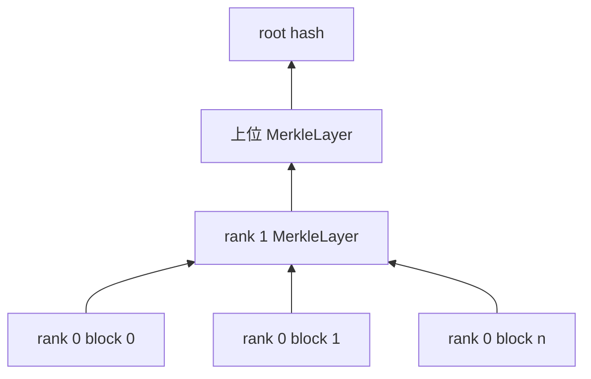
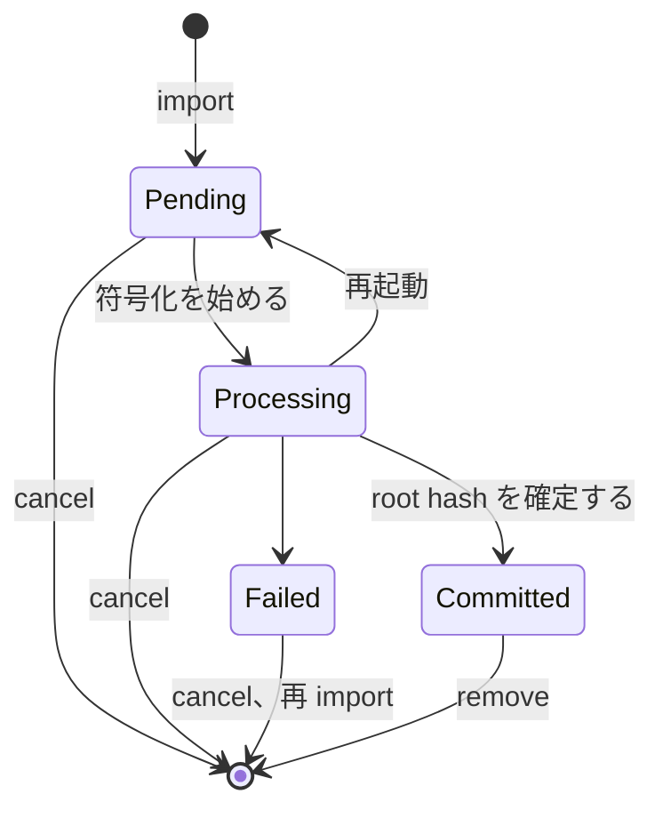
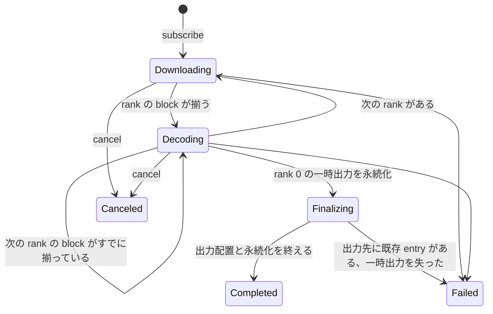

# file の公開と購読の設計

## 1. このドキュメントについて

本書は file を block と Merkle layer へ変換して公開し、購読側で検証および復号する設計を扱う。
語の定義は [terms.md](../terms.md#2-用語一覧) が正とする。

### 1.1 文書間の責務分担

| 文書または正本 | 受け持つもの |
| --- | --- |
| [design.md](../design.md#11-文書間の責務分担) | 全体構成、他の関心事との境界、横断的な依存関係 |
| 本書 | file の公開、購読、Merkle 構造、状態遷移、出力先の予約、Store が守る整合性、block の検証 |
| [node-finder.md](./node-finder.md#2-責務と境界) | AssetKey に対応する node の探索 |
| [storage.md](./storage.md#2-責務と境界) | metadata、block、出力 file の永続化、確定と回収の手順、障害後の回復 |
| [core/negotiator/file](../../daemon/modules/engine/src/core/negotiator/file) | file 公開、購読、転送の実装 |

### 1.2 本書の時制について

本文は完成形の設計を記述する。
実装状況と残作業は §7 に集約する。
現在動く範囲を確認する場合は §7 を先に読む。

## 2. 責務と境界

[FilePublisher](../../daemon/modules/engine/src/core/negotiator/file/file_publisher.rs) は local file を block と Merkle layer に変換し、公開可能な root hash を確定する。
[FileSubscriber](../../daemon/modules/engine/src/core/negotiator/file/file_subscriber.rs) は root hash から必要な block を管理し、揃った layer を上位から順に復号する。
[FileExchanger](../../daemon/modules/engine/src/core/negotiator/file/file_exchanger.rs) は NodeFinder の探索結果を使って相手と Session を張り、publisher と subscriber の block を運ぶ。

符号化、転送、復号を分けることで、local storage の処理を network Session の寿命から独立させる。
publisher と subscriber は公開用と購読用の状態を共有しない。

公開側と購読側は、どちらも同じ 3 層に分かれる。

```text
FilePublisher / FileSubscriber      API の入口。Store と Task を組み立て、Task を起動して停止する
  │
  ├──▶ TaskEncoder / TaskDecoder    符号化と復号、確定前の取り消し、配置と回収の再試行を進める loop
  │      │
  ▼      ▼
FilePublisherStore / FileSubscriberStore
                                    metadata、block、出力 file の整合性と永続化を管理する
```

metadata と block 実体を書き換え、出力 file を作成・配置・削除するのは Store だけである。
TaskDecoder は Store から渡された一時出力の handle へ復号結果を書き、出力先を直接開かない。
FilePublisher、FileSubscriber、Task は Store が公開する操作を通して状態を変える。
この配置により、2 つの storage にまたがる整合性の規則（§4.3）と lock が Store の中で閉じ、lock を型の間で受け渡さずに済む。
削除に失敗した block と一時出力は、Store の sweep が metadata と照合して回収する。
Task は、sweep と Finalizing の配置が成功するまで、間隔を置いて Store に再試行させる。
停止時は確定前の処理を取り消し、確定中の処理は完了を待つ。I/O 障害で終えられなければ Finalizing のまま次回起動へ引き継ぐ。

## 3. Merkle 構造

file 本体を rank 0 の固定長 block に分け、各 block の hash 列を上位の MerkleLayer として再帰的に block 化する。


```mermaid
flowchart BT
    B0[rank 0 block 0]
    B1[rank 0 block 1]
    BN[rank 0 block n]
    L1[rank 1 MerkleLayer]
    LX[上位 MerkleLayer]
    Root[root hash]

    B0 --> L1
    B1 --> L1
    BN --> L1
    L1 --> LX
    LX --> Root
```

root hash から下位 block の hash を段階的に得られるため、受信者は file 全体の hash 一覧を事前に持つ必要がない。
各受信 block は期待する hash と照合してから保存または復号に使う。

MerkleLayer の rank は、その layer が列挙する子 block の rank を表す。
購読側は root hash だけから始めるため、root block の rank は root の layer を復号するまで分からない。
購読側は root の layer の rank を照合せずに次の rank とし、以降の layer では親の rank より 1 小さいことを照合する。

## 4. 状態遷移

外部 API は内部状態名をそのまま公開せず、[daemon-api.md](./daemon-api.md#5-設計判断) の長時間操作の表現に従って安定した contract へ変換する。

### 4.1 公開側

公開側は root hash の確定前後を uncommitted file と committed file に分ける。


```mermaid
stateDiagram-v2
    [*] --> Pending: import
    Pending --> Processing: 符号化を始める
    Processing --> Pending: 再起動
    Processing --> Failed
    Processing --> Committed: root hash を確定する
    Pending --> [*]: cancel
    Processing --> [*]: cancel
    Failed --> [*]: cancel、再 import
    Committed --> [*]: remove
```

Pending、Processing、Failed は uncommitted file の状態であり、Committed だけが network へ広告できる。
root hash が確定するまでは一時 ID を使い、確定後に内容識別子へ commit するため、途中で失敗した処理と広告できる file を区別できる。

uncommitted file の行は commit と cancel で消え、失敗の理由を見せるために Failed だけが残る。
同じ root hash と file 名の committed file がすでにあるときも、新しい committed file を作らずに uncommitted file の行を消す。
同じ path と file 名の uncommitted file は 1 つしか持てない。
Pending か Processing の file がある組の import は `AlreadyExists` で拒否する。
Failed の file がある組の import は、その行を消し、新しい一時 ID で Pending の行を作る。

commit せずに符号化を終えた Task は、cancel、停止、失敗、条件付き更新の不一致（§4.3）のどれで終えた場合も、その一時 ID の block を Store に消させる。
削除に失敗した block は、Pending と Processing の行がない一時 ID の block として sweep が回収する（[storage.md §4.3](./storage.md#43-公開の-commit-と回収)）。
一時 ID を試行ごとに新しくするため、遅れて走る回収が新しい試行の block を消すことはなく、回収の完了を待たずに再 import できる。

remove は committed file を対象にし、公開をやめる。
同じ root hash を別の file 名で公開していれば、block の行と実体は最後の committed file が消えるまで残る。

### 4.2 購読側

購読側は block の取得と layer の復号を交互に進める。


```mermaid
stateDiagram-v2
    [*] --> Downloading: subscribe
    Downloading --> Decoding: rank の block が揃う
    Decoding --> Downloading: 次の rank がある
    Decoding --> Decoding: 次の rank の block がすでに揃っている
    Decoding --> Finalizing: rank 0 の一時出力を永続化
    Finalizing --> Completed: 出力配置と永続化を終える
    Finalizing --> Failed: 出力先に既存 entry がある、一時出力を失った
    Downloading --> Failed
    Decoding --> Failed
    Downloading --> Canceled: cancel
    Decoding --> Canceled: cancel
```

復号中に得た次の rank の hash 群が、次の Downloading の取得対象になる。
cancel は Downloading と Decoding を Canceled にし、行と block を残す。
remove は Finalizing 以外の購読の行を消し、その root hash を参照する購読がなくなれば block の行と実体も消す。
Finalizing の cancel と remove は拒否する。Completed、Failed、Canceled の cancel は状態を変えない。

同じ root hash を複数の購読が参照してよく、block の行と実体は root hash ごとに共有する。
block を保存すると、その root hash を参照する Downloading の購読すべての進捗を更新する。
次の rank の block がほかの購読によってすでに揃っていれば、受信を待たずに次の layer を復号する。

FileExchanger が相手を探す root hash は、Downloading の購読のものに限る。
rank 0 は購読ごとの一時出力へ復号する。
一時出力は出力先と同じ directory に、購読 ID を含む規約の名前で作る。daemon が作成・削除するのはこの名前の file だけである。
Completed の出力 file は利用者の file として扱い、remove でも消さない。

#### 出力先の予約と確定

subscribe は出力先に file、directory、symlink などの既存 entry があれば失敗し、上書きしない。
`.<entry 名>.axus-<購読 ID>.part` の形の名前は daemon が所有する一時出力の予約名であり、利用者の file の最終出力先として登録できない。
予約名は登録時に名前の文字列だけで判定し、ASCII の大小文字を区別せず、既存 entry とは区別できるエラーで拒否する。
購読 A の一時出力名を購読 B の最終出力先として登録し、B の完了後に A が一時出力を作り直すと、B の完成済み出力を消すためである。
予約名の生成と判定の規則は [storage.md §4.5](./storage.md#45-出力の確定と回復) に従う。
同じ出力先を Downloading、Decoding、Finalizing の購読が使っている場合も、開始時に拒否する。
同じ root hash を異なる出力先へ購読することは許す。
予約名以外の開始時の拒否は早期検出であり、大小文字や Unicode 正規化だけが違う別表記までは判定しない。
別表記の衝突と、開始後に外部 process が作った entry は、確定時に上書きしない配置が失敗することで検出し、Failed にする。

一時出力への書き込みを終えても、まだ Completed ではない。
Store が一時出力を永続化し、Finalizing を DB に記録した時点を確定開始とする。
その後、既存 entry を置き換えない rename で出力先へ配置し、配置を永続化してから Completed を記録する。
確定開始後は取り消しを通さず、Completed、Failed、または再試行を待つ Finalizing まで進める。

再起動時は、一時出力と出力先の有無から配置が済んだかを判定する。
判定の規則と、出力先の directory に届かないときに Finalizing を保って再試行する扱いは [storage.md §4.5](./storage.md#45-出力の確定と回復) に従う。
どの場合も出力先の既存 file を上書きも削除もしない。

### 4.3 Store が守る整合性

Task が進める状態遷移は、遷移前に期待する状態を条件に含めた 1 回の更新で書く。
条件に合う行がなければ、先行する状態変更に従い、何も書かない。
失敗の記録も同じ条件で書くため、取り消した購読や公開を Failed で上書きしない。
block の行の登録は既存の行を上書きせず、同じ root hash を共有するほかの購読の進捗を巻き戻さない。

状態の条件だけでは守れない block の操作には、次の lock を使う。

| Store | 割り込まれると起きること | lock |
| --- | --- | --- |
| FilePublisherStore | commit 済みと判定した後に remove が最後の参照を消すと、block のない committed file ができる。remove や sweep の削除中に同じ root hash を commit すると、新しく commit した実体が消える | mutex。commit、remove、sweep の参照確認から実体操作と metadata 更新までを直列化する。open の中の回復も同じ mutex の中で行う。符号化そのものは lock の外で行う |
| FileSubscriberStore | remove や sweep が最後の参照を確認した後、block 実体を消す前に、同じ root hash の subscribe と block の保存が入ると、downloaded と記録した block の実体が消える | read-write lock。subscribe と block の保存は read、remove と sweep は write で取る。block の受信どうしは並行のまま、remove と sweep のあいだだけ止まる |

購読の出力先は、進行中の購読の行に対する DB の一意制約で守る。
Decoding から Finalizing への条件付き更新と、cancel/remove が最初に行う Canceled への条件付き更新を対にする。
先に Finalizing が記録されれば cancel/remove は拒否し、先に Canceled が記録されれば出力配置を始めない。一時出力の削除は、この更新が確定した後に行う。
Finalizing の DB commit の結果が不明なときは、行を読み直して状態を確かめるまで配置も一時出力の削除もしない。
復号と file の同期書き込みの間、共有 block 用の lock を保持し続けない。
一時出力の名前は購読 ID を含むため、遅れて終わった Task や sweep が別の購読の一時出力や出力 file を消すことはない。

2 つの storage をまたぐ書き換えの順序と、途中で終了した状態の回復は [storage.md](./storage.md#4-論理-key-と-migration) が扱う。

## 5. 接続相手と block の検証

購読側は目的の AssetKey を提供する node へ接続する。
公開側から接続を始めるかどうかは §6.2 の保留である。
相手の探索は NodeFinder に委ね、FileExchanger は探索 algorithm を持たない。
購読用と受理用の接続枠を分け、転送方向ごとの資源を確保する。

block 交換 protocol は、要求した hash、受信した hash、保存した block の対応を追跡しなければならない。
汚染 block を永続化しないため、内容 hash の検証は commit より前に行う。

## 6. 設計判断

### 6.1 決定済み

探索と file 交換の分離は [design.md](../design.md#51-決定済み) が正とする。

#### MerkleLayer.rank は子 block の rank を表す

**決定**
MerkleLayer の rank には、その layer を格納する block の rank ではなく、layer が列挙する子 block の rank を記録する。

**理由**
購読側は layer を復号した時点で、次に取得する block の rank をそのまま得られる。
互換性を保つべき既存の wire data はなく、encode から decode までの round-trip test でこの意味を固定している。

**却下案**
格納先 block の rank を記録する案は、修正前の encoder が採っていた意味である。
購読側は layer を復号するたびに、格納先の rank から 1 を引いて次の rank を計算する必要があるため採らない。

#### metadata と block 実体の書き換えを Store に集める

**決定**
公開側と購読側の metadata と block 実体を書き換える操作は Store にだけ置き、lock は Store の内部に持つ。
出力の作成・確定・削除と sweep も Store が行う。
符号化・復号、確定前の取り消し、sweep と配置を再試行する loop は Task に残す。

**理由**
書き換える型が複数あると、2 つの storage にまたがる書き換えを守る lock を型の間で受け渡すことになり、lock を取らない経路がそのまま競合になる。
書き換えを 1 つの型に集めると、整合性の規則と lock の範囲を 1 か所で確かめられる。
実行中の処理の取り消しは loop の寿命に属するため、Store ではなく Task が持つ。

**却下案**
lock を Task に置き、入口の操作を Task に委譲する案は、購読側では subscribe と block の保存まで Task に寄せることになり、Task が処理の制御と保存の整合性の両方を持つ。
すべての操作を Task の loop で直列化して lock をなくす案は、大きな file を符号化または復号しているあいだ、block の受信と remove が止まるため採らない。

#### Task の状態遷移を期待する状態の条件付き更新で書く

**決定**
Task が進める状態遷移と失敗の記録は、期待する状態を条件にした更新で書き、条件に合う行がなければ何も書かない。

**理由**
cancel と remove は Task の処理と並行して呼ばれる。
行全体を書き戻す upsert では、割り込まれた後に古い内容で状態を戻し、消した行を作り直す。
条件付き更新は判定と書き込みを SQLite の 1 文で行うため、確認と書き込みのあいだに割り込みの余地がない。

**却下案**
書き込みの直前に処理の取り消しを確認する案は、確認と書き込みのあいだの割り込みを防げず、取り消しの対象にならない block の保存も守れない。
file ごとの lock で直列化する案は、lock の表を管理する必要があり、cancel が長い復号の終わりを待つ。

#### 購読の cancel と remove を分ける

**決定**
cancel は取得中または復号中の購読を Canceled にして行と block を残す。
remove は Finalizing 以外の行を消して、参照がなくなった block を消す。
確定中はどちらも拒否し、出力 file は削除対象にしない。

**理由**
取り消した購読を記録として残しつつ、Completed と Failed を含むすべての行を消す手段を持つためである。
block を消す経路を remove の 1 つに限ると、解放の条件を 1 か所で確かめられる。

**却下案**
cancel で行まで消す案は、取り消した記録が残らない。
進行中の購読がなくなった時点で block を解放する案は、cancel、完了、失敗の各経路に解放を書くことになる。

#### 公開側の uncommitted file を commit と cancel で消す

**決定**
commit した uncommitted file と cancel した uncommitted file の行は消し、Failed の行だけを残す。
公開側の remove は committed file を対象にし、公開をやめる操作だけを指す。

**理由**
公開の記録は committed file が持つため、commit 後の uncommitted file に残す情報はない。
uncommitted file は path と file 名の組で一意なので、行を残すと同じ file を再び import できなくなる。
Failed の行は失敗の理由を見せるために残し、再 import で新しい一時 ID の行に置き換える。

**却下案**
commit 後も Completed で残す案は、再 import の前に行を消す操作が別に必要になる。
uncommitted file を消す remove を別に持つ案は、公開側の削除操作が 2 種類になり、公開をやめる操作と区別しにくい。

#### 同じ root hash の購読を重複して許す

**決定**
同じ root hash を複数の購読が参照してよい。
block の行と実体は root hash ごとに共有する。

**理由**
同じ内容を別の path へ書き出す用途を残すためである。
block を共有すると、先に揃った block を後の購読が受信せずに使える。

**却下案**
進行中の購読がある root hash の subscribe を拒否する案は、block を保存したときに更新する購読が 1 つに決まるが、同じ内容を複数の path へ同時に書き出せない。

#### remove で block 実体をその場で消す

**決定**
remove は metadata から最後の参照を消した後、同じ lock の中で block 実体を消す。
実体の削除に失敗した場合は、参照のない block として sweep が回収する。

**理由**
消した購読や公開の容量を、再起動を待たずに解放するためである。

**却下案**
remove は metadata だけを消し、block 実体を起動時の回復だけで回収する案は、§4.3 の lock が不要になるが、容量が次の起動まで解放されない。

#### 出力を上書きせず、確定中は取り消さない

**決定**
既存出力と進行中の同一出力先を拒否し、一時出力の復号が終わった後に Finalizing を記録する。
上書きしない配置、配置の永続化、Completed の記録が終わるまで cancel/remove を拒否する。

**理由**
利用者の既存 file と完成済み出力を守りながら、filesystem と DB の確定の間で終了した購読を回復するためである。
確定中に行を消さないことで、再起動後に一時出力の名前と出力先を行から求められる。

**却下案**
出力先へ直接復号する案は、中断時に既存 file と途中出力を区別して保護できない。
確定中の remove を待たせる案は、応答時間が file と DB の同期書き込みに依存するため採らない。

#### 再 import に新しい一時 ID を使う

**決定**
Failed の file の再 import は、Failed の行を新しい一時 ID の行に置き換える。
失敗した試行の block は、回収の完了を待たずに sweep に任せる。

**理由**
回収対象の一時 ID が新しい試行と重ならないため、遅れて走る回収が新しい符号化の block を消すことがない。
回収の記録や再 import の拒否を持たずに済む。

**却下案**
Failed の行と一時 ID を Pending に戻して使い回す案は、古い試行の block の回収が新しい試行と競合するため、回収の完了まで再 import を拒否する仕組みが要る。

### 6.2 保留

#### 公開側の接続先

**現状**
FileExchanger には公開用の接続 task があるが、NodeFinder の want は要求元の NodeProfile を運ばず、`NodeFinder::find_node_profile` が返すのは AssetKey を提供する node だけである。
FileExchanger の公開用の接続 task は自分の root hash で `find_node_profile` を呼ぶため、見つかるのは同じ file を提供するほかの node である。

候補は次の 2 つである。

1. want に要求元の NodeProfile を載せ、NodeFinder が要求する node も返すようにすると公開側から配れるが、want の message が大きくなり、要求元の到達先が中継の node に知られる。
2. 公開側は接続を始めず受理だけにすると NodeFinder は変わらないが、NAT の内側で UPnP を使えない公開側へは購読側が接続できない。

**なぜ今決めないか**
block 交換 protocol がなく、公開側から接続する経路がまだ使われていないためである。

**決める条件**
block 交換 protocol を定義する前に決める。

#### block の hash を照合する位置

**現状**
`FileSubscriber::write_block` は、受け取った値を呼び出し元が示した hash の key に保存し、内容の hash を照合しない。
§5 の「内容 hash の検証は commit より前に行う」を、どの層で満たすかは決めていない。

候補は次の 2 つである。

1. `write_block` で照合すると、どの経路から来た block も保存の前に検証できるが、不正な相手を切るには照合の結果を protocol 層へ返す必要がある。
2. block 交換 protocol で照合すると不正な相手をその場で切れるが、`write_block` を呼ぶ経路が増えるたびに照合を書き足す必要がある。

**なぜ今決めないか**
block 交換 protocol がなく、`write_block` を呼ぶのは test だけであるためである。

**決める条件**
block 交換 protocol を定義する前に決める。

## 7. 現状と残作業

FilePublisher は file の取り込み、block 化、MerkleLayer の生成、root hash の確定、commit、committed block の読み出しを行う。
FileSubscriber は購読の開始、block の保存、rank ごとの復号を行い、公開から復号までを engine 内の round-trip test で確認している。
FileSubscriber は受け取った block の hash を照合しておらず、照合の位置は §6.2 の保留である。

公開側と購読側は §2 の 3 層に分かれ、metadata と block 実体の書き換えを Store に集めている。
Task の状態遷移と失敗の記録は期待する状態を条件に更新し、Store 内の lock で commit、remove、subscribe、block の保存の競合を制御する。
Task は子 CancellationToken で実行中の処理を取り消し、shutdown は worker の終了を待つ。

入口には cancel と remove がある。
公開側は commit と cancel で uncommitted file を消す。
Failed の同じ path と file 名への import は、SQLite の 1 transaction で古い行を消し、新しい一時 ID の Pending の行を作る。
古い試行の block の回収が遅れても、新しい試行の block を消さない。
購読側は同じ root hash の購読を許し、共有 block の進捗をすべての Downloading の購読へ反映する。
取得済みの block が揃っていれば受信を待たずに次の layer を復号し、相手を探す root hash は Downloading のものだけを返す。
Completed の出力 file は remove でも残す。

§4.2 の出力先予約と、file、directory、symlink を含む既存 entry の登録時の拒否を実装している。
一時出力、Finalizing とその回復は未実装である。
公開側は §2 の稼働中の sweep を行い、失敗した回収を TaskEncoder が間隔を延ばしながら再試行する。
購読側の稼働中の block と一時出力の sweep は未実装である。
永続化の残作業は [storage.md §6](./storage.md#6-現状と残作業) に集約する。

FileExchanger には接続と受理の task はあるが、block 要求と応答の message および送受信 loop がない。
公開と購読を始める REST API はない。

確認済みの不具合は [issues.md](../issues.md) を参照する。
