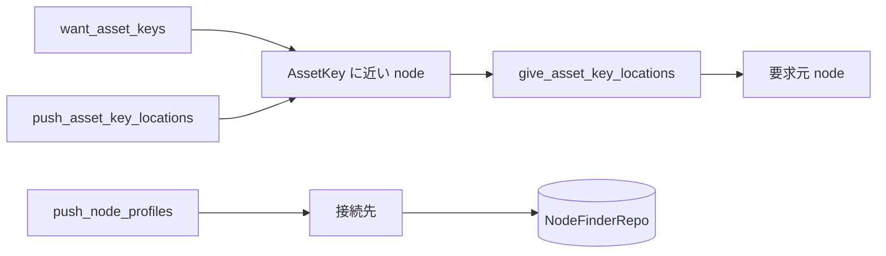

# NodeFinder の設計

## 1. このドキュメントについて

本書は node の所在情報を交換し、AssetKey を提供または要求する node を探す NodeFinder の設計を扱う。
語の定義は [terms.md](../terms.md) が正とする。

### 1.1 文書間の責務分担

| 文書または正本 | 受け持つもの |
| --- | --- |
| [design.md](../design.md#11-文書間の責務分担) | 全体構成、他の関心事との境界、横断的な依存関係 |
| 本書 | NodeFinder の探索、情報伝播、距離計算、保存 |
| [file-transfer.md](./file-transfer.md#2-責務と境界) | 探索結果を使う file の公開と購読 |
| [node_finder.rs](../../daemon/modules/engine/src/core/negotiator/node/node_finder.rs) | NodeFinder の実装 |
| [node_finder_repo.rs](../../daemon/modules/engine/src/core/negotiator/node/node_finder_repo.rs) | 既知 node の保存 |

### 1.2 本書の時制について

本文は完成形の設計を記述する。
実装状況と残作業は §7 に集約する。

## 2. 責務と境界

NodeFinder は既知 node の交換と、AssetKey を提供または要求する node の所在情報を扱う。
NodeFinder は asset の内容を解釈せず、AssetKey と NodeProfile の対応だけを返す。
FileExchanger はこの境界を使うため、探索の message と file 交換の message を混在させない。

[NodeProfileFetcher](../../daemon/modules/engine/src/core/negotiator/node/node_profile_fetcher.rs) は bootstrap 用の NodeProfile 群を外部から取得する。
URI 変換の詳細と checksum は [converter/uri.rs](../../daemon/modules/engine/src/model/converter/uri.rs) が正である。

## 3. 情報の配布

NodeFinder は要求、回答、自発的な広告を分けて伝播させる。

要求と広告を XOR 距離の近い node へ寄せる一方、回答は要求元へ戻す。
受信情報には寿命と件数上限を設け、古い所在情報と無制限な中継を残さない。

## 4. 判断と通信の分離

[TaskComputer](../../daemon/modules/engine/src/core/negotiator/node/task_computer.rs) は、全 Session の受信状態と上位 component の要求を見て、次に送る DataMessage を計算する。
[TaskCommunicator](../../daemon/modules/engine/src/core/negotiator/node/task_communicator.rs) は、Session ごとの handshake と送受信だけを担当する。
判断を 1 箇所へ集約することで、接続ごとの worker に routing policy が分散しない。

FileExchanger から必要な AssetKey を受け取る境界には [FnHub](../../daemon/modules/engine/src/base/sync/fn_hub.rs) を使う。
発火側と登録側を分けることで、NodeFinder は FileExchanger の具象型を参照しない。

## 5. 距離と永続化

[Kadex](../../daemon/modules/engine/src/core/negotiator/node/kadx.rs) は AssetKey の hash と NodeProfile の ID の XOR 距離を比較し、近い node を選ぶ。
距離計算の byte order は protocol の相互運用性に関わるため、別実装を追加する場合は code 上の規則を外部仕様へ昇格させる。

[NodeFinderRepo](../../daemon/modules/engine/src/core/negotiator/node/node_finder_repo.rs) は既知 node を URI 表現のまま SQLite に保存する。
URI を opaque な値として保存することで形式追加のたびに table schema を変えずに済むが、address 単位の SQL 検索は行えない。

## 6. 設計判断

### 6.1 決定済み

この関心事に閉じる追加の決定はない。
NodeFinder と FileExchanger の分離は [design.md](../design.md#51-決定済み) が正とする。

### 6.2 保留

#### NodeFinder の能動探索と冗長度

**現状**
所在情報は定期的な伝播で集め、lookup は接続中 Session の受信状態を走査する形である。

候補は次の 2 つである。

1. Kademlia 型の反復 query を加えると到達率と遅延を制御できるが、query state、timeout、並列度が増える。
2. 伝播だけを維持すると protocol は単純だが、情報が届くまでの時間と未到達を制御しにくい。

**なぜ今決めないか**
実運用規模における lookup の到達率と遅延を測定していないためである。

**決める条件**
複数 hop の結合試験で、購読開始に必要な所在情報の到達率と遅延を測定した時点で決める。

#### 双方向の同時接続で重複した Session の解消

**現状**
[TaskCommunicator](../../daemon/modules/engine/src/core/negotiator/node/task_communicator.rs) は handshake の後、同じ相手との Session が既にあれば、後から handshake を終えた Session を閉じる。
node A と B が互いへ同時に接続すると、A と B はそれぞれ先に handshake を終えた Session を残す。
残した Session が両側で異なると、一方が閉じた接続は他方が残した Session でもあるため、両方の Session が閉じる。
接続元は相手を接続済みとして 180 秒記録するため、その間は同じ相手へ再接続しない。
同じ node の TaskConnector どうしは、接続中の相手を予約して同じ相手へ同時に接続しない。

候補は次の 2 つである。

1. node ID の大小で残す接続方向を決めると、追加の message なしに両側が同じ Session を選べるが、先に登録した Session を後から来た Session で置き換える処理が必要になる。
2. 重複を検出した側が相手へ通知して残す Session を合意すると判定規則を柔軟にできるが、Session の上に新しい message と状態遷移が必要になる。

**なぜ今決めないか**
自 node の NodeProfile は待ち受けアドレスを持たないため、相手のアドレスは bootstrap に指定された NodeProfile からしか得られず、双方向の同時接続が起きる構成は限られる。

**決める条件**
自 node の NodeProfile に待ち受けアドレスを載せる前に決める。

## 7. 現状と残作業

接続、受理、計算、通信の task と SQLite repo があり、lookup は接続中 Session の受信状態だけを走査する。
複数 hop の到達率と遅延を測定し、能動探索と冗長度を決める。
双方向の同時接続で重複した Session の解消規則を決める。
