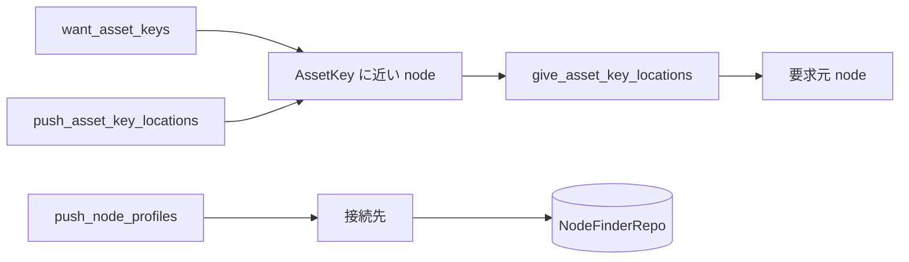

# NodeFinder の設計

## 1. このドキュメントについて

本書は node の所在情報を交換し、AssetKey を提供または要求する node を探す NodeFinder の設計を扱う。
語の定義は [terms.md](../terms.md) が正とする。

### 1.1 文書間の責務分担

| 文書または正本 | 受け持つもの |
| --- | --- |
| [design.md](../design.md#11-文書間の責務分担) | 全体構成、他の関心事との境界、横断的な依存関係 |
| 本書 | NodeFinder の探索、情報伝播、距離計算、保存 |
| [file-transfer.md](./file-transfer.md#2-責務と境界) | 探索結果を使う file の公開と購読 |
| [node_finder.rs](../../daemon/modules/engine/src/core/negotiator/node/node_finder.rs) | NodeFinder の実装 |
| [node_finder_repo.rs](../../daemon/modules/engine/src/core/negotiator/node/node_finder_repo.rs) | 既知 node の保存 |

### 1.2 本書の時制について

本文は完成形の設計を記述する。
実装状況と残作業は §7 に集約する。

## 2. 責務と境界

NodeFinder は既知 node の交換と、AssetKey を提供または要求する node の所在情報を扱う。
NodeFinder は asset の内容を解釈せず、AssetKey と NodeProfile の対応だけを返す。
FileExchanger はこの境界を使うため、探索の message と file 交換の message を混在させない。

[NodeProfileFetcher](../../daemon/modules/engine/src/core/negotiator/node/node_profile_fetcher.rs) は bootstrap 用の NodeProfile 群を外部から取得する。
URI 変換の詳細と checksum は [converter/uri.rs](../../daemon/modules/engine/src/model/converter/uri.rs) が正である。

## 3. 情報の配布

NodeFinder は要求、回答、自発的な広告を分けて伝播させる。

要求と広告を XOR 距離の近い node へ寄せる一方、回答は要求元へ戻す。
受信情報には寿命と件数上限を設け、古い所在情報と無制限な中継を残さない。

## 4. 判断と通信の分離

[TaskComputer](../../daemon/modules/engine/src/core/negotiator/node/task_computer.rs) は、全 Session の受信状態と上位 component の要求を見て、次に送る DataMessage を計算する。
[TaskCommunicator](../../daemon/modules/engine/src/core/negotiator/node/task_communicator.rs) は、Session ごとの handshake と送受信だけを担当する。
判断を 1 箇所へ集約することで、接続ごとの worker に routing policy が分散しない。

FileExchanger から必要な AssetKey を受け取る境界には [FnHub](../../daemon/modules/engine/src/base/sync/fn_hub.rs) を使う。
発火側と登録側を分けることで、NodeFinder は FileExchanger の具象型を参照しない。

## 5. 距離と永続化

[Kadex](../../daemon/modules/engine/src/core/negotiator/node/kadx.rs) は AssetKey の hash と NodeProfile の ID の XOR 距離を比較し、近い node を選ぶ。
距離計算の byte order は protocol の相互運用性に関わるため、別実装を追加する場合は code 上の規則を外部仕様へ昇格させる。

[NodeFinderRepo](../../daemon/modules/engine/src/core/negotiator/node/node_finder_repo.rs) は既知 node を URI 表現のまま SQLite に保存する。
URI を opaque な値として保存することで形式追加のたびに table schema を変えずに済むが、address 単位の SQL 検索は行えない。

## 6. 設計判断

### 6.1 決定済み

NodeFinder と FileExchanger の分離は [design.md](../design.md#51-決定済み) が正とする。

#### 重複した Session は node ID が小さい側から張ったものを残す

**決定**
同じ相手との Session が重複したら、node ID が小さい側から張った Session を残す。
残すべき Session が後から handshake を終えた場合は、先に登録した Session を閉じて入れ替える。

**理由**
同じ node の TaskConnector どうしは接続中の相手を予約するため、重複は 2 つの node が互いへ同時に接続したときに起きる。
handshake を終えた順に Session を残す規則では、両側が異なる Session を残し得る。
一方が閉じた接続は他方が残した Session でもあるため、両方の Session が閉じ、接続元は相手を接続済みとして記録したまま再接続しない。
node ID は Session の署名で確かめた公開鍵から導出するため、両側は追加の message なしに同じ規則で同じ Session を選べる。

**却下案**
重複を検出した側が相手へ通知して残す Session を合意する案は、Session の上に新しい message と状態遷移が必要になるため採らない。

#### 自 node の NodeProfile には起動時に決めたアドレスを載せる

**決定**
自 node の NodeProfile には、設定 `p2p.advertise_addrs` があればそのアドレスを載せる。
設定がなければ、特定のアドレスで待ち受けるときはそのアドレスを、不特定のアドレスで待ち受けるときは到達できる local IP と UPnP の外部 IP に待ち受けポートを付けて載せる。
UPnP は設定 `p2p.use_upnp` で有効にしたときだけ使う。
アドレスは起動時に 1 回だけ決め、IP が変わったときは再起動で反映する。

**理由**
node 自身が知っている情報だけで決まるため、handshake に message を足す必要がない。
`0.0.0.0` で待ち受ける場合や UPnP のない NAT の内側では到達できるアドレスを自動では決められないため、利用者が明示できる設定を優先する。
UPnP はルーターのポート開放の設定を変えるため、利用者が選んだときだけ行う。

**却下案**
接続先から見えた接続元アドレスを handshake で返してもらう案は、NAT の外側のアドレスを知れるが、handshake の message が増え、相手の申告を検証する手段も必要になるため採らない。

### 6.2 保留

#### NodeFinder の能動探索と冗長度

**現状**
所在情報は定期的な伝播で集め、lookup は接続中 Session の受信状態を走査する形である。

候補は次の 2 つである。

1. Kademlia 型の反復 query を加えると到達率と遅延を制御できるが、query state、timeout、並列度が増える。
2. 伝播だけを維持すると protocol は単純だが、情報が届くまでの時間と未到達を制御しにくい。

**なぜ今決めないか**
実運用規模における lookup の到達率と遅延を測定していないためである。

**決める条件**
複数 hop の結合試験で、購読開始に必要な所在情報の到達率と遅延を測定した時点で決める。

## 7. 現状と残作業

接続、受理、計算、通信の task と SQLite repo があり、lookup は接続中 Session の受信状態だけを走査する。
AxusService の起動経路から 2 node を起動し、Session の確立と AssetKey の lookup を結合試験で確認している。
各 task の周期は NodeFinderOption で指定し、結合試験では短い周期を使う。

重複した Session の解消は、互いを bootstrap に指定した 2 node の結合試験で確認している。
lookup で得た NodeProfile には、相手が広告したアドレスが含まれることを結合試験で確認している。

daemon の設定から bootstrap node を指定できるようにし、複数 hop の探索を確かめる。
複数 hop の到達率と遅延を測定し、能動探索と冗長度を決める。
