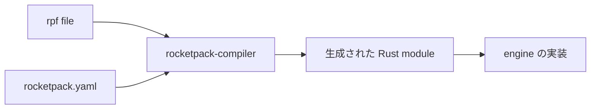

# RocketPack 型の設計

## 1. このドキュメントについて

本書は RocketPack で符号化する型の正、生成物、手書き実装からの移行規約を扱う。
語の定義は [terms.md](../terms.md) が正とする。

### 1.1 文書間の責務分担

| 文書または正本 | 受け持つもの |
| --- | --- |
| [design.md](../design.md#11-文書間の責務分担) | 全体構成、他の関心事との境界、横断的な依存関係 |
| 本書 | Axus が採用する RocketPack 型生成と移行の設計 |
| [rocketpack-compiler](../../daemon/refs/core-rs/entrypoints/rocketpack-compiler) | compiler の実装 |
| [rocketpack-compiled-example](../../daemon/refs/core-rs/entrypoints/rocketpack-compiled-example) | compiler 設定と生成物の例 |
| `.rpf` file | 型、field 番号、外部型参照の正 |

### 1.2 本書の時制について

本文は完成形の設計を記述する。
実装状況と残作業は §6 に集約する。

## 2. 責務と境界

Axus は rpf を型定義の正として、Rust の型宣言と `RocketPackStruct` 実装を生成する。
compiler の内部設計は `core-rs` が持ち、本書は Axus から見た入出力と移行規約だけを扱う。

## 3. 生成の入力と出力

型と field 番号の変更は rpf にだけ加え、生成物にも手書き実装にも加えない。
定義を rpf 1 箇所に集めることで、encode 側と decode 側の field 番号の対応を人手で保つ必要がなくなる。

compiler は指定した directory の `rocketpack.yaml` を読み、`sources` と `generators` に従って生成する。
`sources` は `base_dir`、`includes`、`excludes` で対象の rpf を集める。
`generators` は plugin ごとに `targets` を持ち、`pattern` に一致した rpf を `dir` 配下へ書き出す。
出力は rpf 1 本につき Rust file 1 本であり、file 名は rpf の stem を引き継ぐ。

`pattern` に一致しない rpf は生成対象から外れるため、rpf を追加したときは target の追加も必要になる。
同じ rpf を複数の generator へ渡せるので、言語ごとの出力先を 1 つの設定で管理できる。
`rocketpack.yaml` を置いた directory が生成の起点であり、`base_dir` と `dir` はそこからの相対 path として解決する。

## 4. wire format の移行

rpf は version、package、use、struct、enum、type alias、const を持つ。
struct の field と enum の variant は `@N` の番号を持ち、この N が wire 上の field 番号である。
`Option<T>` の field は値が `None` のとき map から省き、要素数もそれに合わせて数える。
未知の番号を受け取った側は、その field を読み飛ばして残りの復号を続ける。

rpf から外部型として参照する Rust 型は、`RocketPackStruct` を実装していなければならない。
実装を持たない型を参照した場合、誤りは生成時ではなく Rust の compile 時に現れる。

移行の不変条件は wire format を変えないことである。
手書き実装が使っている field 番号をそのまま `@N` へ写し、番号の詰め直しや採番規則の統一を同時に行わない。
1 つの型の宣言と codec を手書きと生成物に分けず、型ごとに正を 1 つにする。

## 5. 設計判断

### 5.1 決定済み

#### RocketPack 型を rpf から生成する

**決定**
RocketPack で符号化する型は rpf を正とし、Rust の型宣言と `RocketPackStruct` 実装を生成する。
生成物は手で編集せず、型と field 番号の変更は rpf にだけ加える。

**理由**
手書きでは pack と unpack が同じ field 番号を別々の箇所で扱い、対応のずれを型で検出できないためである。
定義を 1 箇所に集めることで、Rust 以外の言語向けの生成先を後から追加する余地も残る。

**却下案**
手書きの `RocketPackStruct` 実装を続ける案は、既存 code に採用の痕跡があるが、型の正が実装の中に散るため採用しない。

### 5.2 保留

#### rpf から参照する core-rs 型の扱い

**現状**
`OmniHash` は `RocketPackStruct` を実装しており、手書き実装も `write_struct` で符号化しているため、rpf から外部型としてそのまま参照できる。
`OmniAddr` は実装を持たず、手書きの NodeProfile は string として符号化している。

候補は次の 2 つである。

1. core-rs 側に `RocketPackStruct` を実装して外部型として参照すると、型と符号化を 1 箇所に置けるが、core-rs の型の wire format を Axus の都合で決めることになる。
2. rpf では string や bytes などの組み込み型で表すと core-rs を変更せずに済むが、Rust 型との変換が Axus 側に手書きで残る。

**なぜ今決めないか**
現在の wire format を保つ実装はどちらの案でも書けるため、選択は変換を core-rs と Axus のどちらに置くかの問題に留まるためである。

**決める条件**
`OmniAddr` のように `RocketPackStruct` を持たない core-rs 型を含む型を、最初に rpf へ移す前に決める。

## 6. 現状と残作業

engine の型は手書きの `RocketPackStruct` 実装であり、Axus に rpf と `rocketpack.yaml` はない。
compiler の Rust generator だけが Rust を出力し、C# と Swift の generator は log を残して生成を飛ばす。
