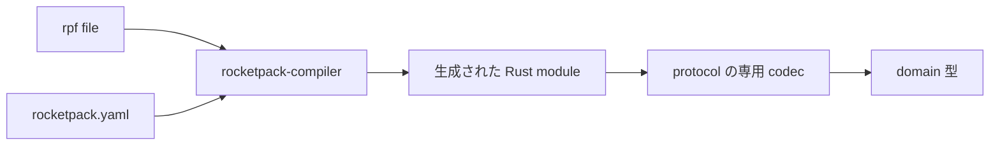

# RocketPack 型の設計

## 1. このドキュメントについて

本書は RocketPack で符号化する型の正、生成物、手書き実装からの移行規約を扱う。
語の定義は [terms.md](../terms.md) が正とする。

### 1.1 文書間の責務分担

| 文書または正本 | 受け持つもの |
| --- | --- |
| [design.md](../design.md#11-文書間の責務分担) | 全体構成、他の関心事との境界、横断的な依存関係 |
| 本書 | Axus が採用する RocketPack 型生成と移行の設計 |
| [rocketpack-compiler.md](../../daemon/refs/core-rs/docs/design/rocketpack-compiler.md) | `rocketpack.yaml` の書式、外部型の参照、生成される module の構成 |
| [core-rs の DESIGN.md](../../daemon/refs/core-rs/docs/DESIGN.md#5-rocketpack) | RocketPack の長さ制約と decode 時の検査 |
| [rocketpack-compiler](../../daemon/refs/core-rs/entrypoints/rocketpack-compiler) | compiler の実装 |
| [rocketpack-compiled-example](../../daemon/refs/core-rs/entrypoints/rocketpack-compiled-example) | compiler 設定と生成物の例 |
| `.rpf` file | 型、field 番号、外部型参照の正 |

### 1.2 本書の時制について

本文は完成形の設計を記述する。
実装状況と残作業は §6 に集約する。

## 2. 責務と境界

Axus は rpf を通信型の正として、Rust の型宣言と `RocketPackStruct` 実装を生成する。
生成型をそのまま扱える AssetKey、FileRef、MerkleLayer は生成型を使う。
DataMessage の `Arc` と `HashMap`、NodeProfile の `OmniAddr` と ID キャッシュのように Rust 上の表現が異なる場合は、手書きの domain 型を別に保持する。
domain 型は `RocketPackStruct` を実装せず、[protocol module](../../daemon/modules/engine/src/protocol) の専用 codec が生成型との相互変換と符号化・復号を担当する。
Session V2 の整数 enum も、専用 codec が生成通信型との対応を持つ。
secure handshake の nonce と鍵合意は [core-rs の secure stream 設計](../../daemon/refs/core-rs/docs/design/secure-stream.md#3-handshake) が扱う。
compiler の内部設計は `core-rs` が持ち、本書は Axus から見た入出力と移行規約だけを扱う。

## 3. 生成の入力と出力

```mermaid
flowchart LR
    Rpf[rpf file]
    Conf[rocketpack.yaml]
    Compiler[rocketpack-compiler]
    Generated[生成された Rust module]
    Codec[protocol の専用 codec]
    Domain[domain 型]

    Rpf --> Compiler
    Conf --> Compiler
    Compiler --> Generated
    Generated --> Codec
    Codec --> Domain
```

定義を rpf 1 箇所に集めることで、encode 側と decode 側の field 番号の対応を人手で保つ必要がなくなる。
入力は [rpfs](../../daemon/rpfs) と [rocketpack.yaml](../../daemon/rocketpack.yaml)、出力は engine の crate root に組み込む [generated.rs](../../daemon/modules/engine/src/generated.rs) と同名 directory である。
生成物は version 管理し、通常の build で compiler を起動しない。[gen-rocketpack.sh](../../daemon/gen-rocketpack.sh) が core-rs workspace から compiler を実行し、target を `AGENT_TEMP_DIR` 配下に置く。
`rocketpack.yaml` の書式、生成される module の構成、生成物の置き場は [rocketpack-compiler.md](../../daemon/refs/core-rs/docs/design/rocketpack-compiler.md) が正とする。

## 4. wire format の移行

rpf の struct の field と enum の variant は `@N` の番号を持ち、この N が wire 上の field 番号である。
`Option<T>` の field は値が `None` のとき map から省き、要素数もそれに合わせて数える。
未知の番号を受け取った側は、その field を読み飛ばして残りの復号を続ける。
移行は `Option` の省略と未知の field の読み飛ばしを前提にしており、手書き実装と生成物の間で field の有無が違っても復号できる。
長さ制約と decode 時の検査は [core-rs の DESIGN.md](../../daemon/refs/core-rs/docs/DESIGN.md#5-rocketpack) が正とする。

移行の不変条件は wire format を変えないことである。
手書き実装が使っている field 番号をそのまま `@N` へ写し、番号の詰め直しや採番規則の統一を同時に行わない。
1 つの型の宣言と codec を手書きと生成物に分けず、型ごとに正を 1 つにする。
rpf では要素数と byte 長の上限を型に書けるため、移した型では上限を decode の時点で強制できる。
生成 pack が同じ上限を送信時にも検査することを受け入れる。

byte 完全一致の例外は DataMessage の複数要素 map である。
`HashMap` から生成型の `BTreeMap` へ変換すると走査順が変わるが、受信側は map の順序に依存しないため wire 互換として許容する。
この部分は旧から新、新から旧の相互復号と map の内容の同一性で検証し、単一要素 map とその他の通信型は byte 固定を維持する。
NodeProfile の URI は §5.1 の決定に従って受容範囲を変更する。
Session V2 への切り替えは生成 codec への移行とは別の protocol 変更であり、旧 V1 の通信互換性を破棄する。
V2 の Hello と用途要求・結果は、専用 scalar codec が未知・重複 field と末尾 byte を拒否する。
ほかの codec の未知 field の扱いは維持する。

## 5. 設計判断

### 5.1 決定済み

#### RocketPack 型を rpf から生成する

**決定**
RocketPack で符号化する型は rpf を正とし、Rust の型宣言と `RocketPackStruct` 実装を生成する。
生成物は手で編集せず、型と field 番号の変更は rpf にだけ加える。

**理由**
手書きでは pack と unpack が同じ field 番号を別々の箇所で扱い、対応のずれを型で検出できないためである。
定義を 1 箇所に集めることで、Rust 以外の言語向けの生成先を後から追加する余地も残る。

**却下案**
手書きの `RocketPackStruct` 実装を続ける案は、既存 code に採用の痕跡があるが、型の正が実装の中に散るため採用しない。

#### OmniAddr は string とし、変換を Axus に置く

**決定**
OmniAddr は Axus の rpf では string とし、domain 型との変換は NodeProfile の専用 codec に置く。
OmniHash と OmniCert は omnikit の manifest を dependency として参照する。core-rs は変更しない。

**理由**
現行の NodeProfile が string として符号化している表現を保ち、Axus の通信表現の責務を Axus に置くためである。
変換は `as_str` と `OmniAddr::from` を使い、parse や正規化を加えない。

**却下案**
core-rs に Axus 用の OmniAddr schema を追加する案は、Axus の通信形式の責務を依存先へ持ち込むため採用しない。

#### NodeProfile の URI とネットワークの受容上限を統一する

**決定**
NodeProfileUri を廃止し、URI とネットワークで同じ生成 NodeProfile を使う。
addrs は双方で最大 8 件とし、pack も生成 codec の上限検査に従う。
9 件以上のアドレスを含む既存 URI の互換性は破棄し、decode 失敗を受け入れる。
URI への符号化は `NodeProfile::to_uri` が `Result<String>` を返し、上限超過を呼び出し元で扱う。

**理由**
同じ NodeProfile に二つの schema と受容範囲を持たず、制約の強い方に統一するためである。
`Display` の `fmt::Error` を `to_string` に返すと panic するため、URI 化を専用メソッドとして公開する。

**却下案**
URI 用の無制限 schema と codec を維持する案は、既存 URI の互換性より schema の統一を優先するため採用しない。

#### 必要な型だけ domain 型と通信型を分ける

**決定**
生成型を直接扱える型には手書きの振る舞いを追加する。
domain 型を別に置く場合は専用 codec で明示的に変換し、domain 型から `RocketPackStruct` を外す。

**理由**
全型の二重化を避けつつ、共有所有権、キャッシュ、enum などの Rust 上の表現を保つためである。

**却下案**
domain 型へ薄い `RocketPackStruct` 実装を残す案は、domain 値と通信表現の変換を送受信側で明示する方針に反するため採用しない。

#### DataMessage の map 順序変化と送信時検査を受け入れる

**決定**
DataMessage も生成型へ切り替える。複数要素 map の順序変化は §4 の例外として許容する。
既存の件数上限を schema に写し、上限超過値を生成 pack が送信時にも拒否することを受け入れる。
DataMessage の byte 長上限と可変長 field の制限は、次の決定に従う。

**理由**
受信側の map 解釈と既存の件数上限を維持したまま、codec の正を rpf に集約するためである。

#### NodeFinder の byte 長を V1 の入力境界で制限する

**決定**
NodeFinder の frame payload と DataMessage の符号化結果は 256 KiB 以下とする。
公開鍵は 256 byte、アドレス 1 件の UTF-8 表現は 512 byte、AssetKey の種別は 64 byte 以下とする。
個別 field の制約と全体サイズの定数は rpf に置き、全体サイズは frame 層と専用 codec が強制する。
既存の件数上限は維持するが、件数以内でも byte 長を超える組み合わせは拒否する。
V1 に適用し、上限以内の wire format は維持する。上限超過の旧 message と URI は受理しない。

**理由**
件数だけでは可変長の値と NodeProfile の重複による受信 memory の消費を制限できない。
frame 自体の上限を下げると、decode 前の buffer も制限できる。

**却下案**
1 MiB の上限は一度に多くの情報を伝播できるが、接続ごとの受信 memory の抑制を優先して採らない。
version の追加は交渉と移行の経路を増やすため、上限超過データの互換性を破棄して V1 に適用する。

#### サイズ予算内で各種類の送信候補を交互に選ぶ

**決定**
送信候補は件数で絞った後、node 情報、要求、応答、所在の伝播から交互に選ぶ。
候補順と最初に選ぶ種類を無作為化し、符号化サイズが予算に収まる候補だけを採用する。
所在情報の AssetKey と NodeProfile 群は一単位として扱い、候補の符号化サイズと collection の header を計上する。
予算から外れた候補は次の計算周期で選び直し、全候補の送信完了は保証しない。

**理由**
一種類の大量情報が他の情報の送信機会を奪うことを防ぎ、現行の無作為な件数選別と同じ寿命で候補を管理するためである。

**却下案**
応答の最優先は要求と所在の伝播を遅らせるため採らない。
未送信 queue は容量、期限、候補更新の管理が増えるため採らない。

#### 設定違反は拒否し、保存済みの不適合 URI は読み飛ばす

**決定**
明示した bootstrap URI と自 node の byte 長違反は、起動時に理由を示して拒否する。
保存済みの不適合 URI は警告して読み飛ばし、DB の行を残す。
アドレスの文字列は切り詰めない。自 node のアドレス件数超過を 8 件に絞る既存の扱いは維持する。

**理由**
設定の誤りを利用者へ返しつつ、使えない既知 node の記録だけを理由に daemon 全体を止めないためである。
文字列の切り詰めは接続先の意味を変え、DB の削除は保存済み情報を失うため採らない。

## 6. 現状と残作業

生成型と専用 codec への移行を完了した。
Session の nonce・signature message は除き、Hello(V2) と V2RequestMessage・V2ResultMessage を rpf から生成して暗号化した確立経路で使う。
再生成の再現性、旧 codec との互換性、URI の境界と送受信の件数上限を検証した。

NodeFinder の frame と DataMessage の符号化結果を 256 KiB 以下に制限している。
field の上限は生成 pack/unpack、全体の上限は frame 層と専用 codec で検査する。
最大件数と最大長の field を組み合わせた test fixture の符号化サイズは 72,386,544 byte であり、この組み合わせを送信時に拒否する。
TaskComputer は件数選別後に各種類の候補を交互に採用し、サイズ予算内に収める。
byte 長の境界、多バイト文字、大量候補の選別と往復、設定違反の拒否、保存済み DB 行の保持を test で確認している。
既知の不具合は [issues.md](../issues.md) を参照する。
