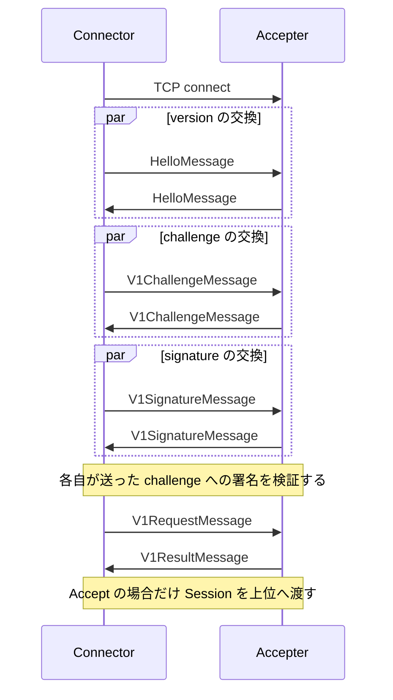

# transport と Session の設計

## 1. このドキュメントについて

本書は TCP 接続を Session へ組み立てる手順、用途分離、停止の contract を扱う。
語の定義は [terms.md](../terms.md) が正とする。

### 1.1 文書間の責務分担

| 文書または正本 | 受け持つもの |
| --- | --- |
| [design.md](../design.md#11-文書間の責務分担) | 全体構成、他の関心事との境界、横断的な依存関係 |
| 本書 | transport、Session の確立、用途分離、停止 |
| [trust-security.md](./trust-security.md#2-責務と境界) | Session が保証する認証と保証しない security の境界 |
| [core/session](../../daemon/modules/engine/src/core/session) | Session protocol の実装 |
| [base/connection](../../daemon/modules/engine/src/base/connection.rs) | TCP 接続と framed stream の実装 |

### 1.2 本書の時制について

本文は完成形の設計を記述する。
実装状況と残作業は §6 に集約する。

## 2. 責務と境界

Session 層は接続を認証し、1 つの用途に割り当てて上位 component へ渡す。
NodeFinder と FileExchanger の message は、それぞれの protocol 層が解釈する。

## 3. 接続と確立

[connection](../../daemon/modules/engine/src/base/connection.rs) は、TCP の受理と発信を trait の背後に置く。
発信側は直接 TCP と SOCKS5 proxy を同じ境界で扱い、受理側は必要に応じて UPnP の port mapping を扱う。
上位層は接続方法ではなく、`FramedStream` が提供する長さ区切りの message 列だけを利用する。

RocketPack の encode と decode は [framed.rs](../../daemon/modules/engine/src/base/connection/stream/framed.rs) の拡張を通す。
これにより session と negotiator は、TCP の partial read や message 境界を扱わずに済む。

発信側と受理側は、version、challenge、signature、用途の順に合意する。

用途の確定を認証の後に置くことで、未認証の接続を NodeFinder や FileExchanger の queue に入れない。
version 交渉は、双方が共通して対応する手順だけを選ばなければならない。

## 4. 用途と停止

1 本の Session は NodeFinder または FileExchanger のどちらか一方に割り当てる（§5.1）。
用途間の多重化を session 層に持ち込まないため、上位 protocol は自分の message だけを処理する。

[Shutdown](../../daemon/modules/engine/src/base/runtime/shutdown.rs) は、所有する下位 component を順に停止するための共通 contract である。
worker は cancellation token または join handle を通じて停止し、所有者の寿命を越えて残らない。

## 5. 設計判断

### 5.1 決定済み

#### 1 Session を 1 用途に割り当てる

**決定**
NodeFinder と FileExchanger は別の Session を使い、用途ごとの受理 queue と接続上限を持つ。

**理由**
message protocol と接続資源を用途ごとに隔離し、一方の負荷が他方の処理を占有しないようにするためである。

### 5.2 保留

#### Session の secure channel

**現状**
相互 challenge signature の後も Session は FramedStream を使い、暗号化と message authentication の方式は定めていない。
V1 の challenge で署名するのは相手が選んだ 32 byte の nonce だけであり、署名は TCP 接続にも handshake の内容にも束縛されていない。
そのため、ある node を自分へ接続させた第三者は、同じ handshake を本物の相手へ中継して両者に互いを認証させ、その後の平文の message を読み書きできる。
また、認証前の相手はどの node にも任意の 32 byte への署名を作らせられる。

候補は次の 2 つである。

1. `core-rs` の `OmniSecureStream` を適用すると既存部品を再利用できるが、handshake 順序と鍵導出の適合を確認する必要がある。`OmniSecureStream` は自分の鍵合意の公開鍵を含む 32 byte の SHA3-256 hash に署名するため、同じ鍵で V1 の challenge に応じ続けると、第三者は challenge として渡した hash への署名を得て、その node になりすませる。
2. Session protocol 専用の鍵合意を定義すると用途に合わせられるが、新しい暗号 protocol の設計と監査が必要になる。

どちらを選んでも、署名の対象に用途を区別する接頭辞と、鍵合意の公開鍵か handshake の transcript を含めなければ、上の中継と署名の流用は防げない。

**なぜ今決めないか**
local の構成確認と storage 処理は secure channel の wire format に依存しないためである。

**決める条件**
既定の bootstrap node の一覧を配布する前と、信頼できない network で FileExchanger または Profile 交換を有効にする前の、いずれか早い時点で決める。

#### Session の version 選択

**現状**
[connector.rs](../../daemon/modules/engine/src/core/session/connector.rs)、[accepter.rs](../../daemon/modules/engine/src/core/session/accepter.rs)、[task_communicator.rs](../../daemon/modules/engine/src/core/negotiator/node/task_communicator.rs) は、送った version と受け取った version の積集合を取り、空なら `UnsupportedType` の error を返す。
NodeFinder の HelloMessage は対応 version を bit flag の集合で運ぶが、[message.rs](../../daemon/modules/engine/src/core/session/message.rs) の Session の HelloMessage は `SessionVersion` を 1 つだけ運び、未知の値を decode で拒否する。
定義されている version は V1 だけであり、複数の共通 version から 1 つを選ぶ規則は定めていない。

候補は次の 2 つである。

1. 数値が最も大きい共通 version を選ぶと新機能を優先できるが、version 番号と優先順位を常に一致させる必要がある。
2. 明示的な優先順位表から選ぶと安定版を優先できるが、version 追加のたびに表を更新する必要がある。

**なぜ今決めないか**
V1 しか存在しないため、どちらの規則でも交渉結果が変わらない。

**決める条件**
`SessionVersion` または `NodeFinderVersion` に 2 つ目の version を追加する前に決める。
`SessionVersion` に追加する場合は、Session の HelloMessage が対応 version の集合を運べるように wire format も同時に変える。

## 6. 現状と残作業

version、challenge、signature、用途選択の message があり、Session は暗号化されていない FramedStream を保持する。
secure channel と複数 version の選択規則を定めるまで、信頼できない network での FileExchanger と Profile 交換は有効にしない。

確認済みの不具合は [issues.md](../issues.md) を参照する。
