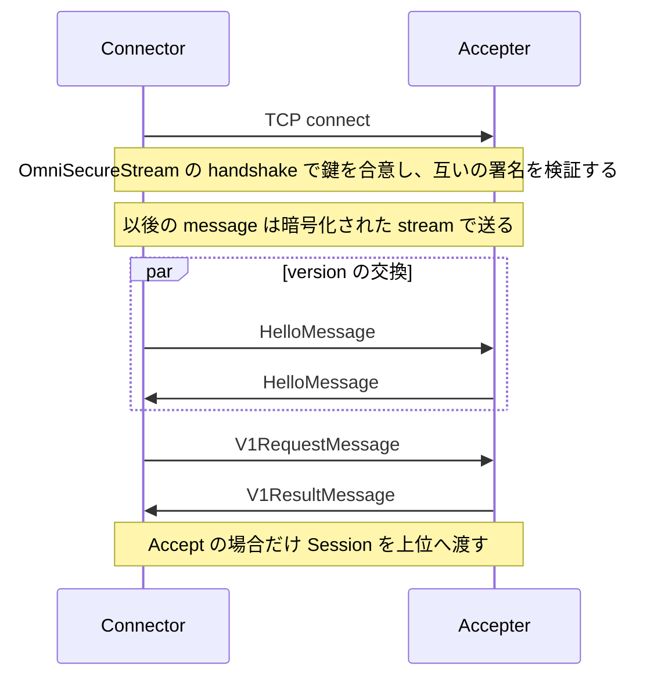

# transport と Session の設計

## 1. このドキュメントについて

本書は TCP 接続を Session へ組み立てる手順、用途分離、停止の contract を扱う。
語の定義は [terms.md](../terms.md) が正とする。

### 1.1 文書間の責務分担

| 文書または正本 | 受け持つもの |
| --- | --- |
| [design.md](../design.md#11-文書間の責務分担) | 全体構成、他の関心事との境界、横断的な依存関係 |
| 本書 | transport、Session の確立、用途分離、停止 |
| [trust-security.md](./trust-security.md#2-責務と境界) | Session が保証する認証と保証しない security の境界 |
| [core/session](../../daemon/modules/engine/src/core/session) | Session protocol の実装 |
| [core-rs の DESIGN.md](../../daemon/refs/core-rs/docs/DESIGN.md#62-secure-connection) | `OmniSecureStream` の handshake の構成、鍵導出、frame の暗号化 |
| [base/connection](../../daemon/modules/engine/src/base/connection.rs) | TCP 接続と framed stream の実装 |

### 1.2 本書の時制について

本文は完成形の設計を記述する。
実装状況と残作業は §6 に集約する。

## 2. 責務と境界

Session 層は接続を認証し、1 つの用途に割り当てて上位 component へ渡す。
NodeFinder と FileExchanger の message は、それぞれの protocol 層が解釈する。

## 3. 接続と確立

[connection](../../daemon/modules/engine/src/base/connection.rs) は、TCP の受理と発信を trait の背後に置く。
発信側は直接 TCP と SOCKS5 proxy を同じ境界で扱い、受理側は必要に応じて UPnP の port mapping を扱う。
Session 層は connection から受け取った byte 列を core-rs の `OmniSecureStream` で保護し、その上に `FramedStream` を置く。
上位層は接続方法ではなく、`FramedStream` が提供する長さ区切りの message 列だけを利用する。

RocketPack の encode と decode は [framed.rs](../../daemon/modules/engine/src/base/connection/stream/framed.rs) の拡張を通す。
これにより session と negotiator は、TCP の partial read や message 境界を扱わずに済む。

発信側と受理側は、secure channel、version、用途の順に合意する。

```mermaid
sequenceDiagram
    participant C as Connector
    participant A as Accepter

    C->>A: TCP connect
    Note over C,A: OmniSecureStream の handshake で鍵を合意し、互いの署名を検証する
    Note over C,A: 以後の message は暗号化された stream で送る
    par version の交換
        C->>A: HelloMessage
        A->>C: HelloMessage
    end
    C->>A: V1RequestMessage
    A->>C: V1ResultMessage
    Note over C,A: Accept の場合だけ Session を上位へ渡す
```

version と用途の交換を暗号化の後に置くため、第三者は交渉の内容を読むことも書き換えることもできない。
用途の確定を認証の後に置くことで、未認証の接続を NodeFinder や FileExchanger の queue に入れない。
version 交渉は、双方が共通して対応する手順だけを選ばなければならない。
Session の handshake は TCP 接続後から secure channel の確立と用途選択の完了までとし、期限、同時数、frame 上限を §5.1 のとおり制限する。
NodeFinder の Hello/Profile 交換は、その後に上位 protocol で行う。
この交換と確立後の受信には通信周期の 3 倍の期限を適用し、詳細は [node-finder.md](./node-finder.md#61-決定済み) が正とする。

## 4. 用途と停止

1 本の Session は NodeFinder または FileExchanger のどちらか一方に割り当てる（§5.1）。
用途間の多重化を session 層に持ち込まないため、上位 protocol は自分の message だけを処理する。

[Shutdown](../../daemon/modules/engine/src/base/runtime/shutdown.rs) は、所有する下位 component を順に停止するための共通 contract である。
worker は cancellation token の cancel で自ら終了し、shutdown はその join handle の終了を待つ。
`abort` で future を外から打ち切らないため、worker は所有者の寿命を越えて残らず、終了時の後始末も必ず通る。

## 5. 設計判断

### 5.1 決定済み

#### 1 Session を 1 用途に割り当てる

**決定**
NodeFinder と FileExchanger は別の Session を使い、用途ごとの受理 queue と接続上限を持つ。

**理由**
message protocol と接続資源を用途ごとに隔離し、一方の負荷が他方の処理を占有しないようにするためである。

#### handshake の期限と並列度

**決定**
受理側と発信側は、TCP 接続後の handshake 全体に 1 つの 10 秒の期限を設け、期限を超えた接続を閉じる。
secure channel の確立、version、用途の各交換で期限を延長しない。
受理側は接続ごとの handshake を並行して進め、同時数を 64 本以下に制限する。
上限を超えた接続は読み書きせずに閉じ、log に記録する。
shutdown は handshake の task も cancellation token で終了させ、その終了を待つ。

**理由**
応答しない相手が受理と発信を占有する時間を制限し、認証前の相手による接続資源の消費を抑えるためである。
接続ごとに処理すると、1 本の無応答接続がほかの handshake を止めない。
同時数にも上限を置くことで、期限が来るまで大量の task と stream が残ることを防ぐ。

**却下案**
少数の worker が handshake を直列に処理する方式は、無応答接続が worker を占有すると次の接続を受理できなくなるため採用しない。

#### 用途に応じた frame 上限

**決定**
handshake 中の frame は送受信とも 16 KiB 以下とする。
用途選択後は NodeFinder の上限を 256 KiB、FileExchanger の上限を 64 MiB に切り替える。
受信 frame が上限を超えた Session は閉じる。
FileExchanger の確立後の受信期限は、block 交換 protocol を定義するときに決める。

**理由**
認証前の message に必要な範囲へ上限を下げ、受信側が frame のために確保する memory を抑えるためである。
NodeFinder も伝播情報の受信で資源を消費するため、確立後に 256 KiB の上限を持つ。
FileExchanger は block 交換 protocol が未定義なので、既存の 64 MiB を維持する。

#### NodeFinder の message の要素数

**決定**
NodeFinder は frame の上限に加え、次の要素数を送受信の上限とする。

| 対象 | 1 message の上限 |
| --- | --- |
| `push_node_profiles` | 32 件 |
| `want_asset_keys` | 1024 件 |
| `give_asset_key_locations` | 1024 件 |
| `push_asset_key_locations` | 1024 件 |
| 各 AssetKey に付ける NodeProfile | 8 件 |
| NodeProfile の `addrs` | 8 件 |

上限を超える message は decode で要素数を読んだ直後、collection を確保する前に拒否し、Session を閉じる。
NodeProfile の `addrs` は wire の decode で検査し、NodeFinder の ProfileMessage にも適用する。
URI も同じ生成 NodeProfile の制約に従い、自 node のアドレスは起動時に 8 件へ切り詰めて警告を記録する。
送信候補の絞り込みと集積情報の扱いは [node-finder.md](./node-finder.md#61-決定済み) が正とする。

**理由**
frame の上限だけでは 1 message 内の collection と所在情報の数が多くなり得るため、受信側の確保量と処理量を要素数でも制限する。
送信側も同じ上限へ収めることで、件数を理由に相手が Session を閉じることを防ぐ。

#### Session の secure channel

**決定**
Session は core-rs の `OmniSecureStream` で TCP の byte 列を暗号化し、双方が相手の署名を必須とする。
相手が署名を送らない接続と、署名の検証に失敗した接続は閉じる。
Session が `OmniSecureStream` の handshake に求める性質は次の 4 つである。

- 署名は、用途を示す接頭辞、接続の向き、双方の profile と一時公開鍵を含む handshake の transcript を対象にする。
- 鍵導出は同じ transcript に依存する。
- 双方は、導出した鍵で鍵確認を交換してから handshake を完了する。鍵確認は、transcript に加えて双方の署名の公開鍵を対象にする。
- 一時公開鍵の作成時刻は transcript に含め、受け取った側は自分の時刻との差が許容幅を超える handshake を拒否する。Session は許容幅を 5 分とする。

Session の HelloMessage、用途の要求と結果は、暗号化された stream で交換する。
challenge と signature を交換する旧い V1 の手順は廃止し、SessionVersion を増やさずに V1 の内容を置き換える。
handshake の message と鍵導出の構成は [core-rs の DESIGN.md](../../daemon/refs/core-rs/docs/DESIGN.md#62-secure-connection) が正とする。

**理由**
相手が選んだ nonce だけに署名する方式では、署名が TCP 接続にも鍵にも結び付かない。
ある node を自分へ接続させた第三者は、handshake を本物の相手へ中継して双方に互いを認証させ、その後の平文を読み書きできる。
一時公開鍵を署名の対象に含めると、第三者は鍵を差し替えられず、合意した鍵を得られない。

署名の対象を署名者自身の値に限ると、別の攻撃が残る。
第三者は中継の途中で署名を自分の鍵によるものへ差し替え、他の node の通信を自分の名義にできる。
記録した handshake を再送して、認証に成功した接続を作ることもできる。
再送は、相手が接続ごとに選ぶ値を transcript に含めることで、署名の検証の失敗として検出する。
署名の差し替えは、鍵確認の対象に双方の署名の公開鍵を含めることで検出する。
差し替えを受けた側は第三者の公開鍵で、署名した本人は自分の公開鍵で鍵確認を計算するため、両者の値が一致しない。

作成時刻の検査は、古い署名をそのまま使う相手を、相手の値に依存せずに拒否するために加える。
transcript による再送の検出は、受け取る側が接続ごとに異なる値を選ぶことに依存するが、時刻の検査はこの前提が崩れた場合にも働く。
代償として、時計が許容幅を超えてずれた node は Session を確立できない。

接頭辞は、同じ署名鍵を Session 以外の署名にも使うときに、ある用途の署名を別の用途へ流用させないためである。
V1 の内容を置き換えるのは、配布済みの network がなく、旧い手順との互換を保つ相手がいないためである。

**却下案**
`OmniSecureStream` の handshake を変更せず、用途の要求に双方の node ID を入れて暗号化後に照合する案は、Axus では名義の差し替えを防げる。
しかし弱点が共有 library に残り、ほかの利用者が同じ照合を各自で実装することになるため採用しない。

Session 専用の鍵合意を Axus に定義する案は、設計と監査の負担が最も大きく、core-rs の secure connection と役割が重複するため採用しない。

handshake に加えて、frame の暗号化、認証付きの終了、鍵の更新まで置き換える案（core-rs の [PR #201](https://github.com/omnius-labs/core-rs/pull/201)）は、Session が求める性質に対して設計と実装が複雑になりすぎるため採用しない。

旧い V1 を残して新しい version を追加する案は、互換を保つ相手がいないまま、中継を防げない手順と接頭辞のない署名対象を実装に残すため採用しない。

### 5.2 保留

#### Session の version 選択

**現状**
[connector.rs](../../daemon/modules/engine/src/core/session/connector.rs)、[accepter.rs](../../daemon/modules/engine/src/core/session/accepter.rs)、[task_communicator.rs](../../daemon/modules/engine/src/core/negotiator/node/task_communicator.rs) は、送った version と受け取った version の積集合を取り、空なら `UnsupportedType` の error を返す。
NodeFinder の HelloMessage は対応 version を bit flag の集合で運ぶが、[message.rs](../../daemon/modules/engine/src/core/session/message.rs) の Session の HelloMessage は `SessionVersion` を 1 つだけ運び、未知の値を decode で拒否する。
定義されている version は V1 だけであり、複数の共通 version から 1 つを選ぶ規則は定めていない。

候補は次の 2 つである。

1. 数値が最も大きい共通 version を選ぶと新機能を優先できるが、version 番号と優先順位を常に一致させる必要がある。
2. 明示的な優先順位表から選ぶと安定版を優先できるが、version 追加のたびに表を更新する必要がある。

**なぜ今決めないか**
V1 しか存在しないため、どちらの規則でも交渉結果が変わらない。

**決める条件**
`SessionVersion` または `NodeFinderVersion` に 2 つ目の version を追加する前に決める。
`SessionVersion` に追加する場合は、Session の HelloMessage が対応 version の集合を運べるように wire format も同時に変える。

## 6. 現状と残作業

§5.1 の secure channel は実装していない。
Session は平文の FramedStream で version、challenge、signature、用途選択の message を交換し、署名は TCP 接続にも鍵にも結び付いていない。
core-rs の `OmniSecureStream` の handshake は、署名の対象が署名者自身の profile と一時公開鍵に限られ、接頭辞、transcript に依存する鍵導出、鍵確認、作成時刻の検査を持たない。
connection は TCP stream を FramedStream に包んで返すため、Session 層は byte 列を受け取れない。
SessionOption の期限、同時数、frame 上限を SessionAccepter と SessionConnector に渡し、handshake の入力境界で強制する。
受理側は TCP の受理と接続ごとの handshake task を分け、shutdown は cancel 後にすべての task の終了を待つ。
用途選択後の frame 上限の切り替えも実装している。
NodeFinder の Hello/Profile 交換時と確立後の受信期限は、通信周期の 3 倍として実装している。
DataMessage と NodeProfile の wire decode で、確保前に要素数の上限を検査する。
上限を超えた Session の切断と、送信側が上限以下へ絞った情報の往復を test で確認している。
NodeFinder の frame 上限は 256 KiB とし、上限ちょうどの送受信と上限超過の拒否を test で確認している。
secure channel を実装し、複数 version の選択規則を定めるまで、信頼できない network での FileExchanger と Profile 交換は有効にしない。

確認済みの不具合は [issues.md](../issues.md) を参照する。
