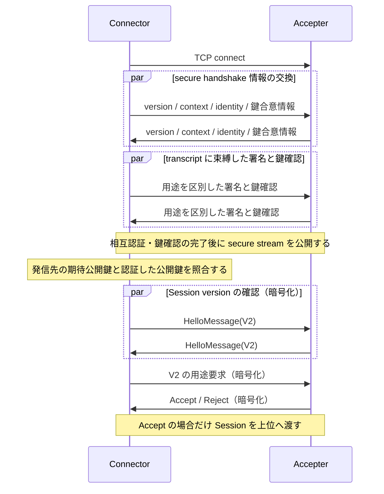

# transport と Session の設計

## 1. このドキュメントについて

本書は TCP 接続を Session へ組み立てる手順、用途分離、停止の contract を扱う。
語の定義は [terms.md](../terms.md) が正とする。

### 1.1 文書間の責務分担

| 文書または正本 | 受け持つもの |
| --- | --- |
| [design.md](../design.md#11-文書間の責務分担) | 全体構成、他の関心事との境界、横断的な依存関係 |
| 本書 | transport、Session の確立、用途分離、停止 |
| [trust-security.md](./trust-security.md#2-責務と境界) | Session が保証する認証と保証しない security の境界 |
| [core-rs の secure stream 設計](../../daemon/refs/core-rs/docs/design/secure-stream.md#1-このドキュメントについて) | 汎用 secure stream の protocol と API の正本 |
| [OmniSecureStream の調査](../knowledges/omni-secure-stream-contract.md) | 依存先の認証 API、鍵導出、I/O について確認した事実 |
| [core/session](../../daemon/modules/engine/src/core/session) | Session protocol の実装 |
| [base/connection](../../daemon/modules/engine/src/base/connection.rs) | TCP 接続と framed stream の実装 |

### 1.2 本書の時制について

本文は完成形の設計を記述する。
実装状況と残作業は §6 に集約する。

## 2. 責務と境界

Session 層は接続を認証し、1 つの用途に割り当てて上位 component へ渡す。
NodeFinder と FileExchanger の message は、それぞれの protocol 層が解釈する。

## 3. 接続と確立

[connection](../../daemon/modules/engine/src/base/connection.rs) は、TCP の受理と発信を trait の背後に置く。
発信側は直接 TCP と SOCKS5 proxy を同じ境界で扱い、受理側は必要に応じて UPnP の port mapping を扱う。
TCP 層は生の非同期 stream を Session 層へ渡す。
Session 層は改修した `OmniSecureStream` で相互認証と暗号化を確立し、その上に `FramedStream` を組み立てる。
上位層は接続方法ではなく、`FramedStream` が提供する長さ区切りの message 列だけを利用する。

RocketPack の encode と decode は [framed.rs](../../daemon/modules/engine/src/base/connection/stream/framed.rs) の拡張を通す。
これにより session と negotiator は、TCP の partial read や message 境界を扱わずに済む。

発信側と受理側は、Session V2 の context を含む secure handshake、公開鍵照合、暗号化した用途選択の順に接続を確立する。

```mermaid
sequenceDiagram
    participant C as Connector
    participant A as Accepter

    C->>A: TCP connect
    par secure handshake 情報の交換
        C->>A: version / context / identity / 鍵合意情報
        A->>C: version / context / identity / 鍵合意情報
    end
    par transcript に束縛した署名と鍵確認
        C->>A: 用途を区別した署名と鍵確認
        A->>C: 用途を区別した署名と鍵確認
    end
    Note over C,A: 相互認証・鍵確認の完了後に secure stream を公開する
    Note over C: 発信先の期待公開鍵と認証した公開鍵を照合する
    par Session version の確認（暗号化）
        C->>A: HelloMessage(V2)
        A->>C: HelloMessage(V2)
    end
    C->>A: V2 の用途要求（暗号化）
    A->>C: Accept / Reject（暗号化）
    Note over C,A: Accept の場合だけ Session を上位へ渡す
```

用途の確定を認証の後に置くことで、未認証の接続を NodeFinder や FileExchanger の queue に入れない。
V2 だけを受理し、V1 へ戻る経路は持たない。
Hello と用途の要求・結果は 1 つの scalar field を持つ message とし、未知・重複 field と末尾 byte を拒否する。
結果は Accept だけを成功とし、Unknown を成功に扱わない。
Session の handshake は TCP 接続後から認証と用途選択の完了までとし、期限、同時数、frame 上限を §5.1 のとおり制限する。
NodeFinder の Hello/Profile 交換は、その後に上位 protocol で行う。
この交換と確立後の受信には通信周期の 3 倍の期限を適用し、詳細は [node-finder.md](./node-finder.md#61-決定済み) が正とする。

## 4. 用途と停止

1 本の Session は NodeFinder または FileExchanger のどちらか一方に割り当てる（§5.1）。
用途間の多重化を session 層に持ち込まないため、上位 protocol は自分の message だけを処理する。

[Shutdown](../../daemon/modules/engine/src/base/runtime/shutdown.rs) は、所有する下位 component を順に停止するための共通 contract である。
worker は cancellation token の cancel で自ら終了し、shutdown はその join handle の終了を待つ。
`abort` で future を外から打ち切らないため、worker は所有者の寿命を越えて残らず、終了時の後始末も必ず通る。

## 5. 設計判断

### 5.1 決定済み

#### 1 Session を 1 用途に割り当てる

**決定**
NodeFinder と FileExchanger は別の Session を使い、用途ごとの受理 queue と接続上限を持つ。

**理由**
message protocol と接続資源を用途ごとに隔離し、一方の負荷が他方の処理を占有しないようにするためである。

#### handshake の期限と並列度

**決定**
受理側と発信側は、TCP 接続後の handshake 全体に 1 つの 10 秒の期限を設け、期限を超えた接続を閉じる。
version、鍵合意、署名、鍵確認、用途の各交換で期限を延長しない。
受理側は接続ごとの handshake を並行して進め、同時数を 64 本以下に制限する。
上限を超えた接続は読み書きせずに閉じ、log に記録する。
shutdown は handshake の task も cancellation token で終了させ、その終了を待つ。

**理由**
応答しない相手が受理と発信を占有する時間を制限し、認証前の相手による接続資源の消費を抑えるためである。
接続ごとに処理すると、1 本の無応答接続がほかの handshake を止めない。
同時数にも上限を置くことで、期限が来るまで大量の task と stream が残ることを防ぐ。

**却下案**
少数の worker が handshake を直列に処理する方式は、無応答接続が worker を占有すると次の接続を受理できなくなるため採用しない。

#### 用途に応じた frame 上限

**決定**
handshake 中の frame は送受信とも 16 KiB 以下とする。
用途選択後は NodeFinder の上限を 256 KiB、FileExchanger の上限を 64 MiB に切り替える。
受信 frame が上限を超えた Session は閉じる。
FileExchanger の確立後の受信期限は、block 交換 protocol を定義するときに決める。

**理由**
認証前の message に必要な範囲へ上限を下げ、受信側が frame のために確保する memory を抑えるためである。
NodeFinder も伝播情報の受信で資源を消費するため、確立後に 256 KiB の上限を持つ。
FileExchanger は block 交換 protocol が未定義なので、既存の 64 MiB を維持する。

#### NodeFinder の message の要素数

**決定**
NodeFinder は frame の上限に加え、次の要素数を送受信の上限とする。

| 対象 | 1 message の上限 |
| --- | --- |
| `push_node_profiles` | 32 件 |
| `want_asset_keys` | 1024 件 |
| `give_asset_key_locations` | 1024 件 |
| `push_asset_key_locations` | 1024 件 |
| 各 AssetKey に付ける NodeProfile | 8 件 |
| NodeProfile の `addrs` | 8 件 |

上限を超える message は decode で要素数を読んだ直後、collection を確保する前に拒否し、Session を閉じる。
NodeProfile の `addrs` は wire の decode で検査し、NodeFinder の ProfileMessage にも適用する。
URI も同じ生成 NodeProfile の制約に従い、自 node のアドレスは起動時に 8 件へ切り詰めて警告を記録する。
送信候補の絞り込みと集積情報の扱いは [node-finder.md](./node-finder.md#61-決定済み) が正とする。

**理由**
frame の上限だけでは 1 message 内の collection と所在情報の数が多くなり得るため、受信側の確保量と処理量を要素数でも制限する。
送信側も同じ上限へ収めることで、件数を理由に相手が Session を閉じることを防ぐ。

#### Session の secure channel

**決定**
独自 handshake を改修した `core-rs` の `OmniSecureStream` を Session V2 へ適用する。
X25519、HKDF-SHA3-256、AES-256-GCM、Ed25519 の組み合わせに固定し、方式の交渉と旧形式への fallback を持たない。
Session V1 と core-rs の旧 secure stream 通信形式は廃止し、保存済みの Ed25519 鍵、公開鍵の DER 表現、node ID を維持する。

署名には用途を区別する接頭辞を付け、用途、version、接続方向の役割、双方の identity と鍵合意情報に束縛する。
鍵導出も同じ接続の情報に束縛し、共有秘密が全ゼロなら拒否する。
相互署名と鍵確認が終わるまで secure stream を上位へ渡さない。
汎用 core-rs の匿名モードは明示的な選択として残すが、Axus は接続前に相互署名必須を固定し、匿名への変更を拒否する。

core-rs は認証した相手の公開鍵と証明書を取得する API、I/O の終了処理、handshake 後の先読み buffer の引き継ぎを提供する。
Axus は期限、並列度、用途別 frame 上限と期待公開鍵の照合を所有する。
汎用 protocol の署名対象の符号化、KDF の label、鍵確認と record の形式は core-rs の正本で確定する。

**理由**
既存の署名鍵と接続部品を使い、暗号手順を core-rs で保守する方針を採るためである。
依存先の [認証と I/O の contract](../knowledges/omni-secure-stream-contract.md) を改修の前提とし、暗号化 stream と長さ区切りの message の責務を分ける。
V1 の任意 nonce への署名を残さず、署名の用途も分けることで、旧手順への切り替えと別用途への署名流用を防ぐ。

**却下案**
Noise と `snow` は鍵合意、transcript hash、暗号状態を再利用できるが、既存の Ed25519 identity への認証追加、I/O、鍵使用量の管理は別に必要になる（[Noise の contract](../knowledges/noise-channel-binding.md)）。
独自 handshake の維持を優先し、Noise への置換は採らない。
TLS 1.3 の採用と Axus 専用の新規暗号実装も、core-rs の既存部品を改修する方針を優先して採らない。

#### 鍵を方向ごとに通信中に更新する

**決定**
送信方向ごとに独立して rekey し、逆方向の通信を止めない。
旧鍵で保護した更新通知を先に送り、その後の record から新鍵を使う。
受信側は通知を検証して対応する受信鍵を更新し、通知の改竄、世代の不一致、枯渇を検出した接続を閉じる。

各方向・各鍵世代で、平文 1 GiB または 2^20 record の早い方をしきい値とする。
通知分の余裕を予約し、しきい値を超える前に更新する。
通常の更新では新しい DH 交換を行わないため、鍵導出用の秘密が漏れた状態から rekey だけで秘密を回復することは保証しない。
鍵と nonce の導出、世代の符号化、I/O の切り替え境界と AES-GCM の鍵使用量評価は core-rs の詳細仕様で確定する。

**理由**
大きな file を転送する途中で、通常の鍵更新を理由に接続を切らないためである。
TCP の順序に従って通知とデータを処理すると、両方向を止める同期手順を持たずに鍵世代を切り替えられる。
しきい値は初期の運用方針であり、安全性評価の代わりにはしない。

**却下案**
しきい値ごとの再接続は上位層の再試行を必要とするため採らない。
両方向の同期更新は確認応答と同時要求の処理を増やすため採らない。

### 5.2 保留

#### Session の version 選択

**現状**
Session は V2 の単独対応を採用し、複数の共通 version から 1 つを選ぶ規則は定めない。
NodeFinder は Session と独立した version を持つ。

候補は次の 2 つである。

1. 数値が最も大きい共通 version を選ぶと新機能を優先できるが、version 番号と優先順位を常に一致させる必要がある。
2. 明示的な優先順位表から選ぶと安定版を優先できるが、version 追加のたびに表を更新する必要がある。

**なぜ今決めないか**
同時に対応する version を 1 つに限るため、優先順位が交渉結果に影響しない。

**決める条件**
Session または NodeFinder で複数 version を同時に受理する前に決める。
Session の場合は、対応 version の集合を運ぶ wire format と、交渉の transcript への束縛を同時に定める。

## 6. 現状と残作業

Session は Mutual の OmniSecureStream V2 上に FramedStream を保持し、version と用途選択を暗号化した message で交換する。
SessionOption の期限、同時数、frame 上限を SessionAccepter と SessionConnector に渡し、handshake の入力境界で強制する。
受理側は TCP の受理と接続ごとの handshake task を分け、shutdown は cancel 後にすべての task の終了を待つ。
用途選択後の frame 上限の切り替えも実装している。
NodeFinder の Hello/Profile 交換時と確立後の受信期限は、通信周期の 3 倍として実装している。
DataMessage と NodeProfile の wire decode で、確保前に要素数の上限を検査する。
上限を超えた Session の切断と、送信側が上限以下へ絞った情報の往復を test で確認している。
NodeFinder の frame 上限は 256 KiB とし、上限ちょうどの送受信と上限超過の拒否を test で確認している。
発信は NodeProfile の期待公開鍵を SessionConnector へ渡し、認証した公開鍵との一致後にだけ application の message を交換する。
V1 の nonce 署名の経路を除き、旧平文形式、匿名、不正 context、暗号化した V1 Hello と不明な結果の拒否を試験した。
直接 TCP と SOCKS5 は raw stream を同じ secure 確立経路へ渡す。SOCKS5 の tunnel 上でも同じ V2 接続と鍵照合を確認した。
暗号化した transport の観測と tag 改竄による切断、用途別 frame 上限、単一期限、同時数の回復、accepted handshake の cancel と join を試験した。
実 TCP の 2〜3 node の探索・接続・重複解消を低い rekey しきい値で確認し、再起動後の鍵・node ID・URI の復元と異なる identity の bootstrap 拒否も確認した。
NodeFinder の ProfileMessage と認証した公開鍵の一致は実際の V2 stream 上で試験した。
core-rs と Axus の受け入れ検証を完了した。FileExchanger の block protocol と上位の Profile 交換は対応する設計文書の残作業に従う。

確認済みの不具合は [issues.md](../issues.md) を参照する。
